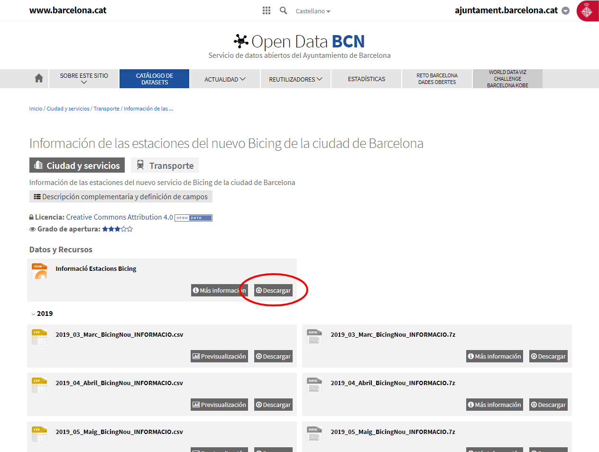

# Ejemplo servicio bicing Barcelona VectorTiles

## Acceso al servicio de datos del Bicing de Barcelona

En el portal Open data del Ayuntamiento de Barcelona podemos encontrar un dataset (conjunto de datos) que contiene las [estaciones del servicio de Bicing](https://opendata-ajuntament.barcelona.cat/data/es/dataset?q=bicing&sort=fecha_publicacion+desc)

Anteriormente tenían un servicio donde daban toda la información de la estación en tiempo real http://wservice.viabicing.cat/v2/stations. Actualmente lo han separado en dos servicios unos con la [información de las estaciones](https://opendata-ajuntament.barcelona.cat/data/es/dataset/informacio-estacions-bicing) (identificador, nombre, coordenadas, etc.) y otro con [estado de las estaciones](https://opendata-ajuntament.barcelona.cat/data/es/dataset/estat-estacions-bicing) (número de bicis disponibles, tipos de bicis, etc)

Si bien el Ayuntamiento de Barcelona no ofrece explicitamente el acceso a los datos del Bicing como un servicio, si que tiene un servicio de datos en tiempo real. La url la podemos encontrar presionando el botón de Descargar del recurso json


*url servicio de bicing*

Al abrir la url https://api.bsmsa.eu/ext/api/bsm/gbfs/v2/en/station_information en nuestro navegador observaremos que la respuesta es un archivo json con un conjunto de elementos que tienen las coordenadas de la localización de la estación de bicing, la dirección, la capacidad, etc.

Mapa que utiliza este servicio, https://www.bicing.barcelona/es/mapa-de-disponibilidad-provisional

El archivo json que retorna el servicio tiene coordenadas pero no es un fichero GeoJSON. [^1]

Para ver estos datos sobre un mapa crearemos un visor utilizando Mapbox GL JS. [^2]

## Creación de un visor

- Crer una carpeta con el nombre de *visor-bicing-vt*.
- Crer una carpeta con el nombre de *public* dentro de la carpeta visor-bicing-vt.
- Crear un archivo con el nombre de *index.html* dentro de la carpeta public.
- Abrir el archivo index.html con un editor de texto y copiar el siguiente código.

```html
<!DOCTYPE html>
<html>
<head>
  <title>Servicio de Bicing realtime VectorTiles</title>
  <meta name='viewport' content='initial-scale=1,maximum-scale=1,user-scalable=no' />
  <script src='https://api.tiles.mapbox.com/mapbox-gl-js/v1.5.0/mapbox-gl.js'></script>
  <link href='https://api.tiles.mapbox.com/mapbox-gl-js/v1.5.0/mapbox-gl.css' rel='stylesheet' />
  <style>
    body {
      margin: 0;
      padding: 0;
    }

    #map {
      position: absolute;
      top: 0;
      bottom: 0;
      width: 100%;
      height: 100%
    }
  </style>
</head>
<body>
  <div id="map"></div>

  <script type="text/javascript">
    var map = new mapboxgl.Map({
      container: 'map',
      style: 'https://geoserveis.icgc.cat/contextmaps/icgc.json',
      center: [2.1777, 41.3887],
      zoom: 13,
      maxZoom: 14,
      hash: true,
    });
  </script>
</body>
</html>
```

- Abrir el archivo index.html en el navegador para ver que carga un mapa centrado en Barcelona.

## Creación del proxy

Crearemos un proxy que nos permita  

- Instalar Node.js [^3]. Descargar la última versión LTS (en este momento es la 12.13.1 LTS) y lo instalaremos con las opciones por defecto. Una vez instalado el Node abrir la consola para verificar que se ha instalado correctamente. Escribir

```bash
node -v
```

- Navegar hasta nuestra carpeta *visor-bicing-vt* y escribir:

```bash
npm init
```

Con este comando estaremos creando el archivo *package.json*. Este comando solicita varios elementos como, por ejemplo, el nombre y la versión de la aplicación. Por ahora, sólo hay que pulsar ENTER para aceptar los valores predeterminados.

- Instalar las dependencias para crear nuestro servicio de proxy [^4]. En este caso utilizaremos Express [^5] como servidor web y el módulo axios [^6].

- Instalar el express y guardarlo en la lista de dependencias

```bash
npm install express --save
```

- Instalar el axios y guardarlo en la lista de dependencias

```bash
npm install axios --save
```

Al ejecutar estos comandos veremos que se crea una carpeta llamada *node_modules* donde se guardan los módulos instalados.

- Crear un archivo llamado *app.js* que servirá de proxy con el servicio de Bicing. Copiar lo siguiente en este archivo.

```js
var express  = require('express');
var app      = express();
var axios = require('axios');
var serverBicing = 'https://api.bsmsa.eu/ext/api/bsm/gbfs/v2/en/station_information';

app.use(express.static('public'));

app.all("/bicingjson/*", function(req, res) {
  console.log('redirecting to Server2');
  var geojson = {
    type: 'FeatureCollection',
    features: []
  };
  axios.get(serverBicing).then(function(response){
    // handle success
    var stations = response.data.data.stations;
    for (var i = stations.length - 1; i >= 0; i--) {
      var station = stations[i];
      var feature = {
        type: 'Feature',
        properties: {
          altitude: station.altitude,
          id: station.station_id,
          address: station.address,
          post_code: station.post_code,
          capacity: station.capacity
        },
        geometry: {
          type: 'Point',
          coordinates: [station.lon, station.lat]
        }
      };
      geojson.features.push(feature);
    }
    res.send(geojson);
  }).catch(function (error) {
    console.log(error);
    res.send(error);
  });
});

app.listen(3000);
```

- Probar que nuestro proxy está funcionando, escribiendo:

```bash
node app.js
```

- Abrir la url de nuestro proxy http://localhost:3000/bicingjson/ en el navegador.

- Escribir en el navegador http://localhost:3000 para ver nuestro mapa.

### Modificar el visor

- Modificar el archivo index.html para que llame al proxy que hemos creado y cargue la capa de bicing. Escribir justo despues de la declaración del mapa.

```html hl_lines="36 37 38 39 40 41 42 43 44 45 46 47 48 49 50 51 52 53 54 55"
<!DOCTYPE html>
<html>
<head>
  <title>Servicio de Bicing realtime VectorTiles</title>
  <meta name='viewport' content='initial-scale=1,maximum-scale=1,user-scalable=no' />
  <script src='https://api.tiles.mapbox.com/mapbox-gl-js/v1.5.0/mapbox-gl.js'></script>
  <link href='https://api.tiles.mapbox.com/mapbox-gl-js/v1.5.0/mapbox-gl.css' rel='stylesheet' />
  <style>
    body {
      margin: 0;
      padding: 0;
    }

    #map {
      position: absolute;
      top: 0;
      bottom: 0;
      width: 100%;
      height: 100%
    }
  </style>
</head>
<body>
  <div id="map"></div>

  <script type="text/javascript">
    var map = new mapboxgl.Map({
      container: 'map',
      style: 'https://geoserveis.icgc.cat/contextmaps/icgc.json',
      center: [2.1777, 41.3887],
      zoom: 13,
      maxZoom: 14,
      hash: true,
    });

    map.on("load", function() {
      //funcion que se llama al terminar de cargar el estilo del mapa

      //agregamos la fuente de datos al mapa
      map.addSource('bicing-source', {
        type: 'geojson',
        data: 'http://localhost:3000/bicingjson/'
      });

      //agregamos la capa con su estilo al mapa
      map.addLayer({
        "id": "bicing",
        "type": "circle",
        "source": "bicing-source",
        "paint": {
            "circle-radius": 6,
            "circle-color": "#B42222"
        },
      });
    });
  </script>
</body>
</html>
```

- Recargar la aplicación y veremos los puntos de las estaciones de bicing.

- Actualizar los datos del mapa. Para actualizar los datos del mapa se debe recargar la capa de estaciones de bicing cada X tiempo. Para recargar la capa cada 3 segundos escribir los siguiente al final de la función que se llama al terminar de cargar el estilo del mapa.

```html hl_lines="56 57 58"
<!DOCTYPE html>
<html>
<head>
  <title>Servicio de Bicing realtime VectorTiles</title>
  <meta name='viewport' content='initial-scale=1,maximum-scale=1,user-scalable=no' />
  <script src='https://api.tiles.mapbox.com/mapbox-gl-js/v1.5.0/mapbox-gl.js'></script>
  <link href='https://api.tiles.mapbox.com/mapbox-gl-js/v1.5.0/mapbox-gl.css' rel='stylesheet' />
  <style>
    body {
      margin: 0;
      padding: 0;
    }

    #map {
      position: absolute;
      top: 0;
      bottom: 0;
      width: 100%;
      height: 100%
    }
  </style>
</head>
<body>
  <div id="map"></div>

  <script type="text/javascript">
    var map = new mapboxgl.Map({
      container: 'map',
      style: 'https://geoserveis.icgc.cat/contextmaps/icgc.json',
      center: [2.1777, 41.3887],
      zoom: 13,
      maxZoom: 14,
      hash: true,
    });

    map.on("load", function() {
      //funcion que se llama al terminar de cargar el estilo del mapa

      //agregamos la fuente de datos al mapa
      map.addSource('bicing-source', {
        type: 'geojson',
        data: 'http://localhost:3000/bicingjson/'
      });

      //agregamos la capa con su estilo al mapa
      map.addLayer({
        "id": "bicing",
        "type": "circle",
        "source": "bicing-source",
        "paint": {
            "circle-radius": 6,
            "circle-color": "#B42222"
        },
      });

      window.setInterval(function() {
        map.getSource('bicing-source').setData('http://localhost:3000/bicingjson/');
      }, 3000);
    });
  </script>
</body>
</html>
```

- Recargar la aplicación y veremos los puntos de las estaciones de bicing. Si vamos a la pestaña de red (network) en la consola de desarrollador del navegador podremos ver que cada 3 segundos se hace una llamada a nuestro proxy.

- Cambiar el estilo de la capa de estaciones de bicing. Para representar las estaciones con un estilo basado en los valores de algunos de sus atributos utilizar el *data-driven style* siguiendo la especificación de estilo de Mapbox [^7]. Modificar la propiedad **paint** de la capa y escribir

```html hl_lines="50 51 52 53 54 55 56 57 58 59 60 61 62 63 64 65 66 67 68 69 70"
<!DOCTYPE html>
<html>
<head>
  <title>Servicio de Bicing realtime VectorTiles</title>
  <meta name='viewport' content='initial-scale=1,maximum-scale=1,user-scalable=no' />
  <script src='https://api.tiles.mapbox.com/mapbox-gl-js/v1.5.0/mapbox-gl.js'></script>
  <link href='https://api.tiles.mapbox.com/mapbox-gl-js/v1.5.0/mapbox-gl.css' rel='stylesheet' />
  <style>
    body {
      margin: 0;
      padding: 0;
    }

    #map {
      position: absolute;
      top: 0;
      bottom: 0;
      width: 100%;
      height: 100%
    }
  </style>
</head>
<body>
  <div id="map"></div>

  <script type="text/javascript">
    var map = new mapboxgl.Map({
      container: 'map',
      style: 'https://geoserveis.icgc.cat/contextmaps/icgc.json',
      center: [2.1777, 41.3887],
      zoom: 13,
      maxZoom: 14,
      hash: true,
    });

    map.on("load", function() {
      //funcion que se llama al terminar de cargar el estilo del mapa

      //agregamos la fuente de datos al mapa
      map.addSource('bicing-source', {
        type: 'geojson',
        data: 'http://localhost:3000/bicingjson/'
      });

      //agregamos la capa con su estilo al mapa
      map.addLayer({
        "id": "bicing",
        "type": "circle",
        "source": "bicing-source",
        "paint": {
          "circle-radius": [
            "interpolate",
            ["linear"],
            ["to-number", ['get','capacity']],
            15,
            5,
            50,
            33
          ],
          "circle-color": [
            "interpolate",
            ["linear"],
            ["to-number", ["get", "altitude"]],
            0,
            "hsl(0, 88%, 55%)",
            50,
            "hsl(108, 93%, 59%)"
          ],
          "circle-opacity": 0.86
        },
      });

      window.setInterval(function() {
        map.getSource('bicing-source').setData('http://localhost:3000/bicingjson/');
      }, 3000);
    });
  </script>
</body>
</html>
```

- Recargar la aplicación y veremos el cambio de estilo de los puntos de las estaciones de bicing.

- Crear un popup para ver la información de la estación al seleccionarla. Escribir después de donde definimos el onload

```html hl_lines="78 79 80 81 82 83 84 85 86 87 88 89 90 91 92 93 94 95 96 97 98"
<!DOCTYPE html>
<html>
<head>
  <title>Servicio de Bicing realtime VectorTiles</title>
  <meta name='viewport' content='initial-scale=1,maximum-scale=1,user-scalable=no' />
  <script src='https://api.tiles.mapbox.com/mapbox-gl-js/v1.5.0/mapbox-gl.js'></script>
  <link href='https://api.tiles.mapbox.com/mapbox-gl-js/v1.5.0/mapbox-gl.css' rel='stylesheet' />
  <style>
    body {
      margin: 0;
      padding: 0;
    }

    #map {
      position: absolute;
      top: 0;
      bottom: 0;
      width: 100%;
      height: 100%
    }
  </style>
</head>
<body>
  <div id="map"></div>

  <script type="text/javascript">
    var map = new mapboxgl.Map({
      container: 'map',
      style: 'https://geoserveis.icgc.cat/contextmaps/icgc.json',
      center: [2.1777, 41.3887],
      zoom: 13,
      maxZoom: 14,
      hash: true,
    });

    map.on("load", function() {
      //funcion que se llama al terminar de cargar el estilo del mapa

      //agregamos la fuente de datos al mapa
      map.addSource('bicing-source', {
        type: 'geojson',
        data: 'http://localhost:3000/bicingjson/'
      });

      //agregamos la capa con su estilo al mapa
      map.addLayer({
        "id": "bicing",
        "type": "circle",
        "source": "bicing-source",
        "paint": {
          "circle-radius": [
            "interpolate",
            ["linear"],
            ["to-number", ['get','capacity']],
            15,
            5,
            50,
            33
          ],
          "circle-color": [
            "interpolate",
            ["linear"],
            ["to-number", ["get", "altitude"]],
            0,
            "hsl(0, 88%, 55%)",
            50,
            "hsl(108, 93%, 59%)"
          ],
          "circle-opacity": 0.86
        },
      });

      window.setInterval(function() {
        map.getSource('bicing-source').setData('http://localhost:3000/bicingjson/');
      }, 3000);
    });

    map.on('click', function(e) {
      var features = map.queryRenderedFeatures(e.point, { layers: ['bicing'] });

      // if the features have no info, return nothing
      if (!features.length) {
          return;
      }

      var feature = features[0];

      // Populate the popup and set its coordinates
      // based on the feature found
      var popup = new mapboxgl.Popup()
      .setLngLat(feature.geometry.coordinates)
      .setHTML('<div id=\'popup\' class=\'popup\' style=\'z-index: 10;\'> <h5> ' + feature.properties.id + ' </h5>' +
      '<ul class=\'list-group\'>' +
      '<li class=\'list-group-item\'> ' + feature.properties.address + ' </li>' +
      '<li class=\'list-group-item\'> Altitud: ' + feature.properties.altitude + ' </li>' +
      '<li class=\'list-group-item\'> Capacidad: ' + feature.properties.capacity + ' </li></ul></div>')
      .addTo(map);
    });
  </script>
</body>
</html>
```

- Recargar la página y hacer click sobre alguna estación para ver su información en tiempo real.

- Cambiar el tipo de cursor al pasar sobre una estación. Escribir después de donde definimos el onload

```html hl_lines="100 101 102 103 104 105"
<!DOCTYPE html>
<html>
<head>
  <title>Servicio de Bicing realtime VectorTiles</title>
  <meta name='viewport' content='initial-scale=1,maximum-scale=1,user-scalable=no' />
  <script src='https://api.tiles.mapbox.com/mapbox-gl-js/v1.5.0/mapbox-gl.js'></script>
  <link href='https://api.tiles.mapbox.com/mapbox-gl-js/v1.5.0/mapbox-gl.css' rel='stylesheet' />
  <style>
    body {
      margin: 0;
      padding: 0;
    }

    #map {
      position: absolute;
      top: 0;
      bottom: 0;
      width: 100%;
      height: 100%
    }
  </style>
</head>
<body>
  <div id="map"></div>

  <script type="text/javascript">
    var map = new mapboxgl.Map({
      container: 'map',
      style: 'https://geoserveis.icgc.cat/contextmaps/icgc.json',
      center: [2.1777, 41.3887],
      zoom: 13,
      maxZoom: 14,
      hash: true,
    });

    map.on("load", function() {
      //funcion que se llama al terminar de cargar el estilo del mapa

      //agregamos la fuente de datos al mapa
      map.addSource('bicing-source', {
        type: 'geojson',
        data: 'http://localhost:3000/bicingjson/'
      });

      //agregamos la capa con su estilo al mapa
      map.addLayer({
        "id": "bicing",
        "type": "circle",
        "source": "bicing-source",
        "paint": {
          "circle-radius": [
            "interpolate",
            ["linear"],
            ["to-number", ['get','capacity']],
            15,
            5,
            50,
            33
          ],
          "circle-color": [
            "interpolate",
            ["linear"],
            ["to-number", ["get", "altitude"]],
            0,
            "hsl(0, 88%, 55%)",
            50,
            "hsl(108, 93%, 59%)"
          ],
          "circle-opacity": 0.86
        },
      });

      window.setInterval(function() {
        map.getSource('bicing-source').setData('http://localhost:3000/bicingjson/');
      }, 3000);
    });

    map.on('click', function(e) {
      var features = map.queryRenderedFeatures(e.point, { layers: ['bicing'] });

      // if the features have no info, return nothing
      if (!features.length) {
          return;
      }

      var feature = features[0];

      // Populate the popup and set its coordinates
      // based on the feature found
      var popup = new mapboxgl.Popup()
      .setLngLat(feature.geometry.coordinates)
      .setHTML('<div id=\'popup\' class=\'popup\' style=\'z-index: 10;\'> <h5> ' + feature.properties.id + ' </h5>' +
      '<ul class=\'list-group\'>' +
      '<li class=\'list-group-item\'> ' + feature.properties.streetName + ' </li>' +
      '<li class=\'list-group-item\'> Bikes: ' + feature.properties.bikes + ' </li>' +
      '<li class=\'list-group-item\'> slots: ' + feature.properties.slots + ' </li></ul></div>')
      .addTo(map);
    });

    // Use the same approach as above to indicate that the symbols are clickable
    // by changing the cursor style to 'pointer'
    map.on('mousemove', function(e) {
        var features = map.queryRenderedFeatures(e.point, { layers: ['bicing'] });
        map.getCanvas().style.cursor = features.length ? 'pointer' : '';
    });
  </script>
</body>
</html>
```

- Recargar la página y pasar sobre alguna estación para ver el cambio del cursor.


*mapa de servicio de bicing*

### Modificar el proxy

Modificaremos el proxy para agregar los datos de disponibilidad de bicis en las estaciones. Para ello debemos llamar al servicio de [estado de estaciones](https://api.bsmsa.eu/ext/api/bsm/gbfs/v2/en/station_status).

Al abrir la url del servicio podemos ver que está el listado de las estaciones con una serie de datos. En este caso no hay datos de posición, ni de descripción sólo datos del estado de la estación. Podemos ver que también hay un campo con el *station_id* que nos servirá para vincular los datos de estado de la estación con la estación correspondiente.

- Agregar la url del servicio de estado de estaciones

```js  hl_lines="5"
var express  = require('express');
var app      = express();
var axios = require('axios');
var serverBicing = 'https://api.bsmsa.eu/ext/api/bsm/gbfs/v2/en/station_information';
var statusBicing = 'https://api.bsmsa.eu/ext/api/bsm/gbfs/v2/en/station_status';

app.use(express.static('public'));

app.all("/bicingjson/*", function(req, res) {
  console.log('redirecting to Server2');
  var geojson = {
    type: 'FeatureCollection',
    features: []
  };
  axios.get(serverBicing).then(function(response){
    // handle success
    var stations = response.data.data.stations;
    for (var i = stations.length - 1; i >= 0; i--) {
      var station = stations[i];
      var feature = {
        type: 'Feature',
        properties: {
          altitude: station.altitude,
          id: station.station_id,
          address: station.address,
          post_code: station.post_code,
          capacity: station.capacity
        },
        geometry: {
          type: 'Point',
          coordinates: [station.lon, station.lat]
        }
      };
      geojson.features.push(feature);
    }
    res.send(geojson);
  }).catch(function (error) {
    console.log(error);
    res.send(error);
  });
});

app.listen(3000);
```

- Combinar la información del estado de estaciones con la información de la estación

```js  hl_lines="16 17 18 19 20 21 22 23 24 25 26 27 28 29 30 31 32 33 34 35 36 37 38 39 40 41 42 43 44 45 46 47 48 49 50 51 52 53 54"
var express  = require('express');
var app      = express();
var axios = require('axios');
var serverBicing = 'https://api.bsmsa.eu/ext/api/bsm/gbfs/v2/en/station_information';
var statusBicing = 'https://api.bsmsa.eu/ext/api/bsm/gbfs/v2/en/station_status';

app.use(express.static('public'));

app.all("/bicingjson/*", function(req, res) {
  console.log('redirecting to Server2');
  var geojson = {
    type: 'FeatureCollection',
    features: []
  };
  
  Promise.all([axios.get(serverBicing), axios.get(statusBicing)]).then((responses) => {
	var stations = responses[0].data.data.stations;
    for (var i = stations.length - 1; i >= 0; i--) {
      var station = stations[i];
      var feature = {
        type: 'Feature',
        properties: {
          altitude: station.altitude,
          id: station.station_id,
          address: station.address,
          post_code: station.post_code,
          capacity: station.capacity
        },
        geometry: {
          type: 'Point',
          coordinates: [station.lon, station.lat]
        }
      };
      geojson.features.push(feature);
	}
	
	var status = responses[1].data.data.stations;

	for (var i = status.length - 1; i >= 0; i--) {
		var stat = status[i];
		for (var j = geojson.features.length - 1; j >= 0; j--) {
			var feat = geojson.features[j];
			if(feat.properties.id === stat.station_id) {
				feat.properties.num_bikes_available = stat.num_bikes_available;
				feat.properties.num_bikes_available_types = stat.num_bikes_available_types;
				feat.properties.num_docks_available = stat.num_docks_available;
			}
		}
	}
	res.send(geojson);
  }).catch(function (error) {
    console.log(error);
    res.send(error);
  });
});

app.listen(3000);
``` 

### Modificar el visor

- Modificaremos el visor para cambiar el color del círculo dependiendo del númere de bicis disponibles en la estación

```html hl_lines="60 61 62 63 64 65 66 67 68"
<!DOCTYPE html>
<html>
<head>
  <title>Servicio de Bicing realtime VectorTiles</title>
  <meta name='viewport' content='initial-scale=1,maximum-scale=1,user-scalable=no' />
  <script src='https://api.tiles.mapbox.com/mapbox-gl-js/v1.5.0/mapbox-gl.js'></script>
  <link href='https://api.tiles.mapbox.com/mapbox-gl-js/v1.5.0/mapbox-gl.css' rel='stylesheet' />
  <style>
    body {
      margin: 0;
      padding: 0;
    }

    #map {
      position: absolute;
      top: 0;
      bottom: 0;
      width: 100%;
      height: 100%
    }
  </style>
</head>
<body>
  <div id="map"></div>

  <script type="text/javascript">
    var map = new mapboxgl.Map({
      container: 'map',
      style: 'https://geoserveis.icgc.cat/contextmaps/icgc.json',
      center: [2.1777, 41.3887],
      zoom: 13,
      maxZoom: 14,
      hash: true,
    });

    map.on("load", function() {
      //funcion que se llama al terminar de cargar el estilo del mapa

      //agregamos la fuente de datos al mapa
      map.addSource('bicing-source', {
        type: 'geojson',
        data: 'http://localhost:3000/bicingjson/'
      });

      //agregamos la capa con su estilo al mapa
      map.addLayer({
        "id": "bicing",
        "type": "circle",
        "source": "bicing-source",
        "paint": {
          "circle-radius": [
            "interpolate",
            ["linear"],
            ["to-number", ['get','capacity']],
            15,
            5,
            50,
            33
          ],
          "circle-color": [
            "interpolate",
            ["linear"],
            ["to-number", ["get", "num_bikes_available"]],
            0,
            "#ff0000",
            15,
            "#00ff00"
          ],
          "circle-opacity": 0.86
        },
      });

      window.setInterval(function() {
        map.getSource('bicing-source').setData('http://localhost:3000/bicingjson/');
      }, 3000);
    });

    map.on('click', function(e) {
      var features = map.queryRenderedFeatures(e.point, { layers: ['bicing'] });

      // if the features have no info, return nothing
      if (!features.length) {
          return;
      }

      var feature = features[0];

      // Populate the popup and set its coordinates
      // based on the feature found
      var popup = new mapboxgl.Popup()
      .setLngLat(feature.geometry.coordinates)
      .setHTML('<div id=\'popup\' class=\'popup\' style=\'z-index: 10;\'> <h5> ' + feature.properties.id + ' </h5>' +
      '<ul class=\'list-group\'>' +
      '<li class=\'list-group-item\'> ' + feature.properties.streetName + ' </li>' +
      '<li class=\'list-group-item\'> Bikes: ' + feature.properties.bikes + ' </li>' +
      '<li class=\'list-group-item\'> slots: ' + feature.properties.slots + ' </li></ul></div>')
      .addTo(map);
    });

    // Use the same approach as above to indicate that the symbols are clickable
    // by changing the cursor style to 'pointer'
    map.on('mousemove', function(e) {
        var features = map.queryRenderedFeatures(e.point, { layers: ['bicing'] });
        map.getCanvas().style.cursor = features.length ? 'pointer' : '';
    });
  </script>
</body>
</html>
```

!!! question "Ejercicio"
	Cambiar el estilo de los puntos de las estaciones. Cambiar los rangos del tamaño del punto y cambiar el rango de colores.

## Referencias

[^1]: https://es.wikipedia.org/wiki/GeoJSON
[^2]: https://www.mapbox.com/mapbox-gl-js/api/
[^3]: https://nodejs.org/es/
[^4]: https://es.wikipedia.org/wiki/Servidor_proxy
[^5]: http://expressjs.com/
[^6]: https://github.com/axios/axios
[^7]: https://www.mapbox.com/mapbox-gl-js/style-spec
