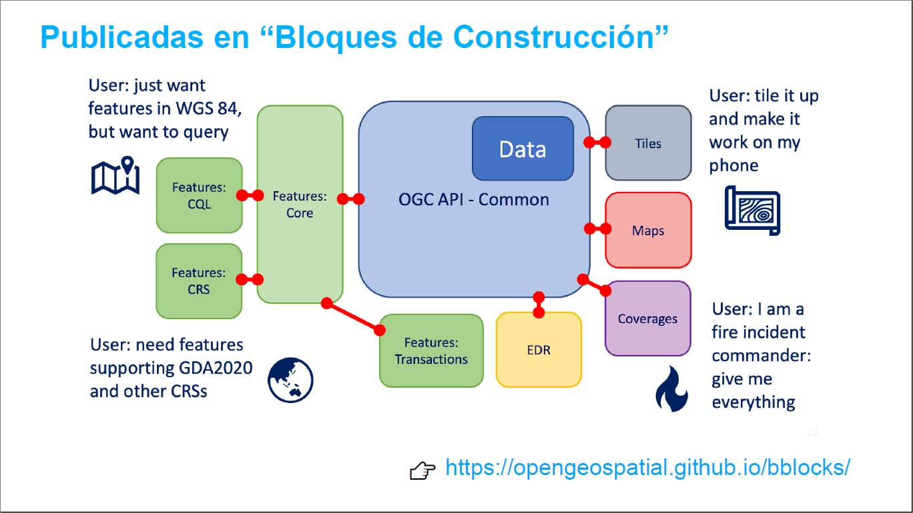

# OGC API

La familia de estándares API de OGC se está desarrollando para facilitar que cualquier persona proporcione datos geoespaciales a la web. Estos estándares se basan en el legado de los estándares de servicios web de OGC (WMS, WFS, WCS, WPS, etc.), pero definen API centradas en recursos que aprovechan las prácticas modernas de desarrollo web.

Estos estándares se están construyendo como "bloques de construcción" que se pueden usar para ensamblar nuevas API para el acceso web a contenido geoespacial.

[https://ogcapi.ogc.org/](https://ogcapi.ogc.org/)

