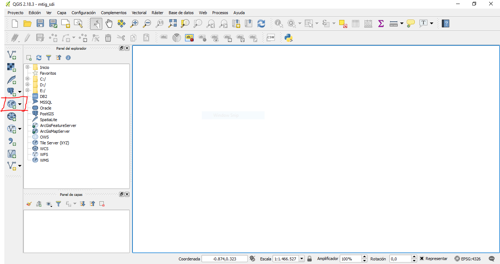
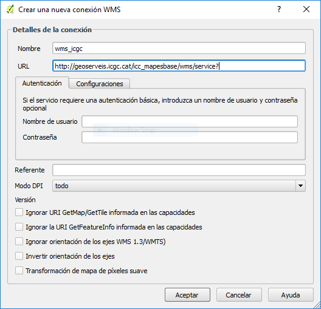

# Clientes de mapas

!!! note "Nota"
    La mayorías de los conceptos son sacados del Libro libre SIG de Victor Olaya http://volaya.github.io/libro-sig/

Un cliente es un elemento que utiliza los datos proporcionados por un servicio. Para ello, realiza una petición a la que el servicio responde enviando dichos datos, estos datos serán los que después se emplearán para realizar cualquier otra tarea, principalmente la representación de estos para que el usuario pueda visualizarlos. El cliente es, de este modo, el intermediario entre el usuario y los servicios y datos que el servidor ofrece. [^1]

El cliente debe disponer de capacidades para formular peticiones a servidores, así como para procesar las respuestas que estos devolverán. No obstante, estas capacidades pueden variar ampliamente de un cliente a otro, desde el mínimo necesario para simplemente representar los datos obtenidos del servidor hasta conjuntos de funcionalidades mucho más avanzadas pensadas para un uso intensivo de esos mismos datos.

Distinguimos dos tipos de clientes en función de las capacidades que tengan: clientes ligeros y clientes pesados.

* **Cliente ligero.** Se denomina *ligero* por el tamaño relativamente reducido del programa en sí, lo cual va consecuentemente asociado a unas capacidades limitadas. Hablamos de clientes ligeros cuando nos referimos a *Web Mapping* y a clientes que se ejecutan sobre un navegador Web, los cuales son siempre sencillos en cuanto a sus funcionalidades. En el momento de la carga de la página Web que contiene al cliente, el navegador descarga toda la lógica del programa, lo cual hace necesario limitar el tamaño de este. No obstante, los clientes Web empiezan progresivamente a ampliar sus posibilidades, y en ello juegan un importante papel otros servicios distintos a los de mapas o los de datos, como pueden ser los de procesos. Estos permiten que las funcionalidades adicionales no se implementen en el propio cliente (y por tanto sin aumentar en exceso su tamaño y sin disminuir su «ligereza»), sino que sean accedidas también como servicios remotos. La evolución de la cartografía Web en esta dirección se dirige desde el Web Mapping al Web GIS.

* **Cliente pesado.** A diferencia del cliente ligero, el cliente *pesado* es una aplicación individual que no se ejecuta sobre otra aplicación soporte como puede ser un navegador Web. Al ser un programa independiente, debe ocuparse de toda la lógica del proceso y de proveer todas las funcionalidades necesarias, por lo que su tamaño es generalmente mayor. Pese a ello, un cliente pesado no ha de ser necesariamente más potente y con más funcionalidades que uno ligero (aunque habitualmente lo es), ya que existen aplicaciones muy sencillas con capacidad para conectarse a servicios de mapas, que ofrecen poco más que un visor de cartografía. La diferencia no estriba en las capacidades del programa, sino en el enfoque a la hora de implementar este y el uso o no de otra aplicación «plataforma», generalmente en forma de un navegador Web. Los clientes pesados suelen permitir el uso de datos no procedentes directamente del acceso a servicios, tales como datos en ficheros locales, y no están pensados exclusivamente como clientes, sino como aplicaciones más amplias que además disponen de capacidades para aprovechar un determinado tipo de servicios. Dicho de otro modo, un cliente pesado tal y como un SIG de escritorio tiene utilidad aunque no se emplee como cliente de ningún servicio y no se disponga de conexión a red alguna, ya que puede alimentarse con datos locales y todas sus restantes funcionalidades (análisis, preparación de cartografía, etc.) pueden aprovecharse con dichos datos.

## Clientes web

Hablamos de un cliente Web cuando este se ejecuta sobre un navegador Web. Por lo tanto un cliente Web es un cliente *ligero*. En el ámbito de los SIG hablamos de *Web Mapping* o de *Web SIG*.

La cartografía Web tiene ciertas limitaciones respecto al SIG de escritorio, ya que la Web tiene sus propias limitaciones. Un ejemplo de esto es la limitación impuesta por el propio navegador como marco de trabajo. Las propias ventajas que este aporta son también responsables de ciertas limitaciones, ya que en el desarrollo de una aplicación SIG Web no se tiene la misma libertad que al desarrollar una aplicación de escritorio.

Otro aspecto problemático es la propia red, especialmente en lo que respecta a su fiabilidad y rendimiento. Todos los datos que el cliente emplea en una aplicación de cartografía Web provienen de la red, y por tanto existe una fuerte dependencia entre la aplicación y el funcionamiento tanto de esta como del servidor que a través de ella nos proporciona esos datos. El rendimiento de la red es más importante aún si cabe en el caso de trabajar con información geográfica, ya que los datos suelen ser voluminosos.

### Mashup

Se conoce como *mashup* o *aplicación Web híbrida* a una aplicación que basa sus contenidos en los de otras páginas Web, integrándolos y creando una nueva página que ofrece un servicio distinto. Un mashup accede a los servicios que otras páginas proporcionan de forma pública dando un uso distinto a estos en un nuevo contexto.

Los mashups existen en todos los ámbitos de las aplicaciones Web, pero es en el ámbito SIG donde han adquirido una mayor importancia y en el que proliferan en mayor medida. Es por esto que resulta de interés tratarlos con algo más de profundidad, pues el impacto que están teniendo en la popularización de las tecnologías SIG es muy elevado.

Principales razones por las que los mashups con componente SIG son tan populares:

* La mayoría de la información que encontramos en la Web puede georreferenciarse. Esto hace que una gran parte de los contenidos de una página Web puedan complementarse con algún tipo de elemento geográfico, principalmente un visor de cartografía en el que poder mostrar esa información georreferenciada con la que se trabaja.

* La información geográfica es de difícil acceso, especialmente a gran escala y por parte de usuarios o desarrolladores no especializados. Si el interés de añadir a cualquier página Web algún elemento de tipo SIG resulta claro, también es cierto que suelen necesitarse datos adicionales con que acompañar a los propios datos de la página. Es decir, si nuestra página Web recoge información sobre restaurantes en la zona, mostrar la localización de esos restaurantes enriquecerá el contenido, aunque para que esta funcionalidad sea verdaderamente útil deberemos contar con algún tipo de mapa base (cartografía de calles, fotografía aérea, etc.) que ayude al usuario a emplazar un restaurante dado o calcular la forma óptima de llegar hasta él.

Esta cartografía base implica un coste elevado, normalmente no asumible para un uso como este. Sin embargo, disponer de una cartografía base ofrecida por un proveedor que permita crear algún tipo de mashup sobre ella facilita que existan este tipo de servicios, como así lo atestigua el gran número de distintas aplicaciones Web que se desarrollan de este modo.

Google Maps es el servicio más popular para la creación de mashups y el que ha supuesto una verdadera revolución en este sentido. Actualmente existen alternativas que le están ganando terreno a Google Maps, tales como; OpenStreetMap (OSM) como capa base y el desarrollo de librerías Web de mapas de Software Libre como OpenLayers o Leaflet.

## Práctica conectar servicios OGC con QGIS

### QGIS - Visualizar una capa WMS

Utilizaremos el programa **QGIS** para visualizar servicios WMS.

1. Abrir el *QGIS desktop* y crear un nuevo proyecto llamado *sdis_mgeo*
2. Presionar el botón de agregar WMS/WMTS del QGIS para desplegar el diálogo de añadir capa
    
    Add WMS
3. En el diálogo de añadir capa presionar el botón de *nuevo* para desplegar el diálogo de crear una nueva conexión.
4. En el diálogo de crear conexión debemos rellenar el campo nombre con el nombre que queremos dar a esta conexión y el campo URL con la dirección del servicio WMS. Una vez rellenados los campos presionar el botón de Aceptar.
    
    WMS ICGC

    En este caso utilizaremos la url del servidor WMS del ICGC.

  		http://geoserveis.icgc.cat/icc_mapesbase/wms/service?

5. En el diálogo de añadir capa presionar el botón de *conectar* para cargar el listado de capas del servicio.
    
    Listado de capas ICGC
6. Seleccionar la(s) capa(s) que queremos cargar en nuestro mapa y presionamos el botón de Añadir. Nos debe cargar el servicio WMS en nuestro mapa.
    
    Visualizar WMS ICGC
7. Instalar el complemento **QGIS Network Logger** para ver las peticiones que hace el QGIS.

### QGIS - Visualizar una capa XYZ

Utilizaremos el programa **QGIS** para visualizar servicios XYZ.

1. Abrir el *QGIS desktop* y abrir el proyecto llamado *sdis_mgeo*
2. En el panel explorador del QGIS presionar con el botón derecho del mouse sobre *Tile Server (XYZ)* para desplegar el menú donde debemos seleccionar la opción de *New Connection...* que nos mostrará el diálogo de añadir nueva conexión.
    
    Add XYZ
3. En el diálogo de añadir nueva conexión debemos escribir la URL de nuestro servicio y presionar el botón de Aceptar. Luego se desplegarán un dialogo donde debemos colocar el nombre que queremos dar a la conexión y presionamos Aceptar.
    
    XYZ OSM

    En este caso utilizaremos la url del servidor de teselas de OpenStreetMap.

        http://c.tile.osm.org/{z}/{x}/{y}.png

4. En el panel explorador ahora debe aparece la conexión definida. Para agregarla al mapa hacemos doble click sobre el nombre de la conexión.
    
    Visualizar XYZ OSM
    
!!! question "Ejercicio 0,5 pt"
    Agregar la capa WMTS de la ortofoto o topográfico del servicio WMTS del ICGC

    http://geoserveis.icc.cat/icc_mapesmultibase/noutm/wmts/orto/GRID3857/{z}/{x}/{y}.jpeg

## Práctica conectar servicios OGC con Leaflet

### Leaflet - Visualizar una capa WMS

Utilizaremos la librería **Leaflet** para crear un cliente *ligero* web donde visualizar servicios WMS.

1. Crear una carpeta llamada *visor* dentro del directorio htdocs del Xampp.

	C:\xampp\htdocs\visor

2. Crear el archivo *wms.html* dentro de la carpeta visor. En este archivo crearemos la estructura básica del nuestro html y cargaremos la librería Leaflet. Para ello escribir los siguiente:

    ``` html
    <!DOCTYPE html>
    <html lang="en">
    <head>
        <meta charset="UTF-8">
        <meta name="viewport" content="width=device-width, initial-scale=1.0">
        <title>Visor simple con Leaflet</title>
        <link rel="stylesheet" href="https://unpkg.com/leaflet@1.7.1/dist/leaflet.css" />
        <style type="text/css">
            #mapid { height: 600px; width: 600px;}
        </style>
    </head>
    <body>
        <div id="mapid"></div>
        <script src="https://unpkg.com/leaflet@1.7.1/dist/leaflet.js"></script>
    </body>
    </html>
    ```

3. Agregar el código para crear el mapa. Debajo de donde cargamos la librería de Leaflet.

    ``` html hl_lines="15 16 17 18"
    <!DOCTYPE html>
    <html lang="en">
    <head>
        <meta charset="UTF-8">
        <meta name="viewport" content="width=device-width, initial-scale=1.0">
        <title>Visor simple con Leaflet</title>
        <link rel="stylesheet" href="https://unpkg.com/leaflet@1.7.1/dist/leaflet.css" />
        <style type="text/css">
            #mapid { height: 600px; width: 600px;}
        </style>
    </head>
    <body>
        <div id="mapid"></div>
        <script src="https://unpkg.com/leaflet@1.7.1/dist/leaflet.js"></script>
        <script>
            //Creamos el objeto mapa.
            var map = L.map('mapid').setView([41.68, 1.85], 9);
        </script>
    </body>
    </html>
    ```

4. Agregar la capa WMS.

    ``` html hl_lines="18 19 20"
    <!DOCTYPE html>
    <html lang="en">
    <head>
        <meta charset="UTF-8">
        <meta name="viewport" content="width=device-width, initial-scale=1.0">
        <title>Visor simple con Leaflet</title>
        <link rel="stylesheet" href="https://unpkg.com/leaflet@1.7.1/dist/leaflet.css" />
        <style type="text/css">
            #mapid { height: 600px; width: 600px;}
        </style>
    </head>
    <body>
        <div id="mapid"></div>
        <script src="https://unpkg.com/leaflet@1.7.1/dist/leaflet.js"></script>
        <script>
            //Creamos el objeto mapa.
            var map = L.map('mapid').setView([41.68, 1.85], 9);
            var wmsTopoIcgc = L.tileLayer.wms('https://geoserveis.icgc.cat/icc_mapesbase/wms/service?', {
            layers: 'mtc5m'
            }).addTo(map);
        </script>
    </body>
    </html>
    ```

5. Abrir el navegador y ver que nuestro visor está funcionando correctamente.

    http://localhost/visor/wms.html

### Leaflet - Visualizar una capa XYZ

Utilizaremos la librería **Leaflet** para crear un cliente *ligero* web donde visualizar servicios WMS.

1. Crear el archivo *xyz.html* dentro de la carpeta visor. En este archivo crearemos la estructura básica del nuestro html y cargaremos la librería Leaflet. Para ello escribir los siguiente:

    ``` html
    <!DOCTYPE html>
    <html lang="en">
    <head>
        <meta charset="UTF-8">
        <meta name="viewport" content="width=device-width, initial-scale=1.0">
        <title>Visor simple con Leaflet</title>
        <link rel="stylesheet" href="https://unpkg.com/leaflet@1.7.1/dist/leaflet.css" />
        <style type="text/css">
            #mapid { height: 600px; width: 600px;}
        </style>
    </head>
    <body>
        <div id="mapid"></div>
        <script src="https://unpkg.com/leaflet@1.7.1/dist/leaflet.js"></script>
    </body>
    </html>
    ```

2. Agregar el código para crear el mapa. Debajo de donde cargamos la librería de Leaflet.

    ``` html hl_lines="15 16 17 18"
    <!DOCTYPE html>
    <html lang="en">
    <head>
        <meta charset="UTF-8">
        <meta name="viewport" content="width=device-width, initial-scale=1.0">
        <title>Visor simple con Leaflet</title>
        <link rel="stylesheet" href="https://unpkg.com/leaflet@1.7.1/dist/leaflet.css" />
        <style type="text/css">
            #mapid { height: 600px; width: 600px;}
        </style>
    </head>
    <body>
        <div id="mapid"></div>
        <script src="https://unpkg.com/leaflet@1.7.1/dist/leaflet.js"></script>
        <script>
            //Creamos el objeto mapa.
            var map = L.map('mapid').setView([41.68, 1.85], 9);
        </script>
    </body>
    </html>
    ```

3. Agregar la capa XYZ

    ``` html hl_lines="18 19 20"
    <!DOCTYPE html>
    <html lang="en">
    <head>
        <meta charset="UTF-8">
        <meta name="viewport" content="width=device-width, initial-scale=1.0">
        <title>Visor simple con Leaflet</title>
        <link rel="stylesheet" href="https://unpkg.com/leaflet@1.7.1/dist/leaflet.css" />
        <style type="text/css">
            #mapid { height: 600px; width: 600px;}
        </style>
    </head>
    <body>
        <div id="mapid"></div>
        <script src="https://unpkg.com/leaflet@1.7.1/dist/leaflet.js"></script>
        <script>
            //Creamos el objeto mapa.
            var map = L.map('mapid').setView([41.68, 1.85], 9);
            var wmtsOpenStreetMap = L.tileLayer('http://{s}.tile.osm.org/{z}/{x}/{y}.png', {
            attribution: '&copy; <a href="http://osm.org/copyright">OpenStreetMap</a> contributors'
        }).addTo(map);
        </script>
    </body>
    </html>
    ```

4. Abrir el navegador y ver que nuestro visor está funcionando correctamente.

    http://localhost/visor/xyz.html


!!! question "Ejercicio 1 pt"
    * Agregar sobre la capa de OpenStreetMap la capa Catastro del servicio WMS de la Dirección General del Catastro. (0,5 pt)
    * Aplicar transparencia a la capa. (0,5 pt)

    http://www.catastro.minhap.gob.es/esp/wms.asp

## Práctica conectar servicios OGC con ArcGIS Online

Abrimos la página de ArcGIS Online https://uab.maps.arcgis.com/home/index.html he iniciamos la sesión con nuestra cuenta.

En el menú seleccionamos **Mapa** para crear un nuevo mapa

Dentro del menú del mapa seleccionamos *Agregar* -> *Agregar una capa desde la web* y se nos muestra una nueva ventana


ArcGis Online agregar desde URL

En esta nueva ventana seleccionar en el desplegable la opción de *Servicio web del WMS OGC*

En el campo URL copiar la url del servicio WMS del ICGC https://geoserveis.icgc.cat/icc_mapesbase/wms/service?

Presionar el botón de **Obtener Capas** para cargar las capas del servicio y seleccionar la capa de *Ortofoto de Catalunya 1:5000 vigent*


ArcGis Online agregar WMS

Finalmente presionar el botón de *Agregar capa* para ver la capa en nuetro mapa


ArcGis Online capa WMS

## Referencias

[^1]: http://volaya.github.io/libro-sig/
