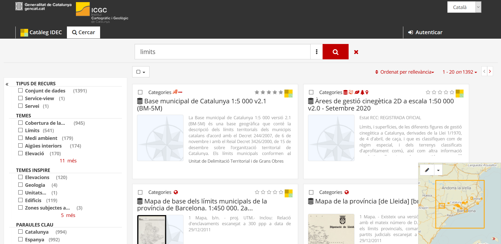
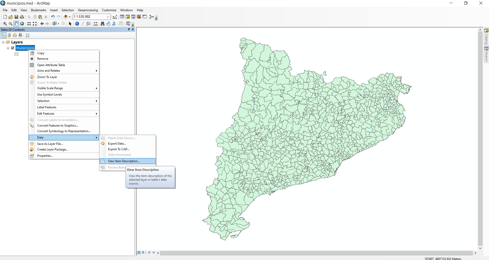
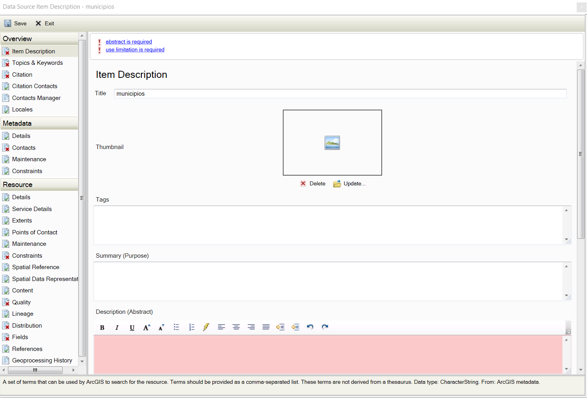
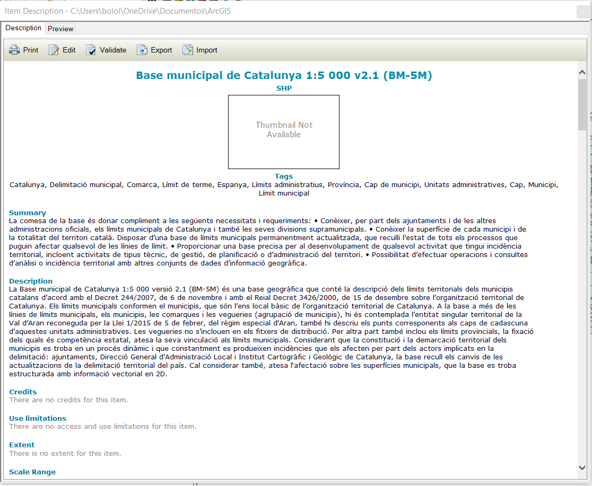
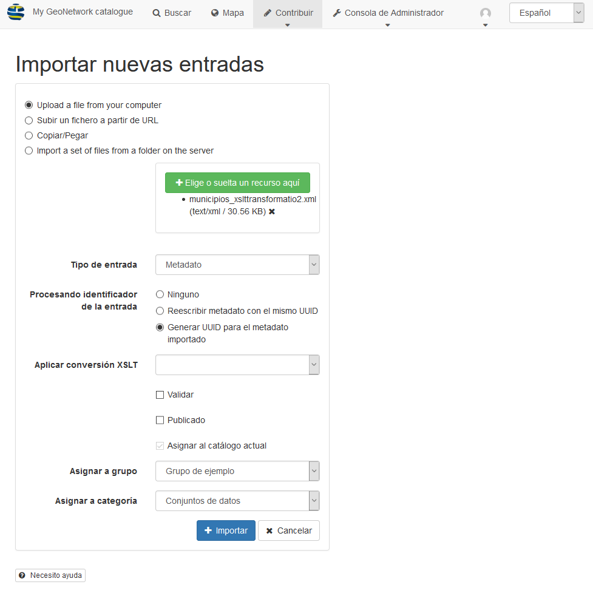
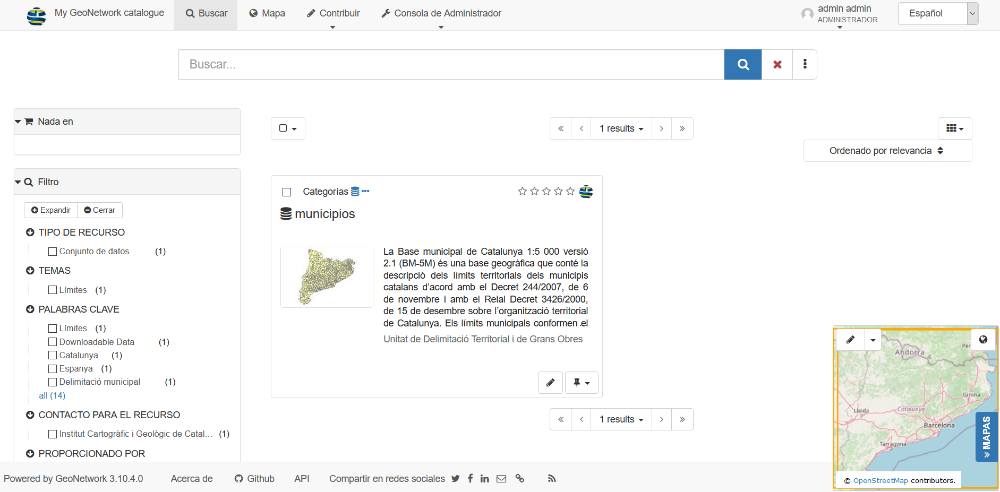

# Creación de metadatos

## Creación de metadatos desde ArcGIS

Como ya se ha comentado anteriormente la creación de metadatos de forma manual es un proceso complejo y largo por lo que la mejor forma de crearlos es mediante algún editor de metadatados. 

En este caso utilizaremos el editor de metadatos que tiene integrado ArcGIS para generar un metadato mediante un ejemplo de un conjunto de datos de los límites municipales de Catalunya. 

### Elegir un estilo de metadatos

La información disponible para ver y editar en la pestaña Descripción está determinada por el estilo de metadatos seleccionado. [^1]

Abra el cuadro de diálogo **Opciones** para la aplicación ArcGIS for Desktop. 

* En ArcMap, haga clic en **Personalizar** > **Opciones de ArcMap**.
* En ArcCatalog, haga clic en **Personalizar** > **Opciones de ArcCatalog**.

Haga clic en la pestaña **Metadatos**.

En el desplegable seleccionar el estilo de metadato que se desea crear en este caso *INSPIRE Metadata Directive*

### Descargar la capa de información y el metadato correspondiente.

Ir a la web de la [Infraestructura de Dades Espacials de Catalunya (IDEC)](https://ide.cat/)

En el catálogo de metadatos buscar *limits*

Seleccionar el primer resultado **Base municipal de Catalunya 1:5 000 v2.1 (BM-5M)**

Resultado de búsqueda 

Al seleccionar el metadato nos abre una página con el [detalle del metadato](https://ide.cat/geonetwork/srv/cat/catalog.search#/metadata/base-municipal-5k-v2r1).

Para descargar los datos ir al apartado de **Descàrregues i enllaços** del metadato y presionar el botón de *Obrir enllaç* que aparece junto a **Descàrrega SHP**

Para descargar el metadato ir al apartado de **Informació de la metadada** y presionar el enlace **Descarregar metadata**

### Cargar la capa en ArcGis e importar el metadato

#### Cargar la capa

Dentro del archivo (zip) de datos descargado hay varios shapefile. Seleccionaremos el archivo llamado *bm5mv21sh0tpm1_20200601_0.shp*

Cargarmos el shapefile dentro de nuestra geodatabase podemos llamarla **municipios** (también se puede cargar el shapefile directamente). Y luego cargamos la capa en el mapa.

Una vez cargada la capa de municipios en el mapa presionamos con el botón derecho sobre la capa y vamos a *Data* > *View Item Description...*. Esto nos abre una ventana nueva con el metadato de la capa.

Ver metadato de la capa

Podemos ver que en el metadato ya hay algunos datos extraídos automáticamente de la información de la capa, pero vemos que faltan muchos otros datos.

Si presionamos el botón de editar nos muestra el formulario de edición del metadato y nos indica todos los campos que faltan por rellenar para cumplir con el estilo de metadato seleccionado.

Editor metadatos

#### Importar el metadato

Abrimos el ArcCatalog y buscamos la capa de municipios hacemos click con el botón derecho y seleccionamos *Item Description...*. Esto nos abre una nueva ventana donde podemos ver el metadato pero a diferencia de la ventana que se desplega al ver la descripción de la capa directamente en el mapa nos muestra más opciones no solo la de impresión y edición sino que también podemos validar, exportar o importar el metadato. 

Presionamos el botón de *Importar* y nos muestra el formulario de importación. En el campo de Source Metadata seleccionamos el archivo xml descargado de la IDEC. En el import type seleccionamos la opción **FROM_ISO19139** y en el Target Metadata dejamos nuestra capa. Presionamos OK.

Una vez terminado el proceso podemos ver que se han rellenado muchos de los campos del metadato.

Importar metadato

##### Completar la información que falta por rellenar

###### Overview

* **Citation** -> New Identifier -> Code = bm5mv21sh0tpm1_20200601_0

###### Metadata

* **Datails** -> Language = Spanish; Castilian
* **Contacts** -> Unitat de Delimitacó Territorial i de Grans Obres (Unknown) -> Role = Point of Contact

###### Resource

* **Datails** -> Language = Spanish; Castilian
* **Points of Contacts** -> Unitat de Delimitacó Territorial i de Grans Obres (Unknown) -> Role = Point of Contact
* **Constraints** -> Legal Constraints -> Access Connstraints = Licence
* **Quality** -> Scope Level = Dataset
* **Distribution** -> Distributor -> Unitat de Delimitacó Territorial i de Grans Obres (Unknown) -> Role = Point of Contact
* **Fields** -> Details: municipios
    
    * *Entity Type* -> Definition = Polígonos de límites municipales
    * *Entity Type* -> Definition Source = ICGC
    * Attribute:CODIMUNI -> Definition = Código INE municipal
    * Attribute:CODIMUNI -> Definition Source = INE
    * Attribute:CODIMUNI -> New Unrepresentable Domain = Cada registro tiene un código único

!!! question "Ejercicio 1pt"
    Completar la información del resto de campos del metadato

## Exportación desde ArcGIS e importación en GeoNetwork

### Exportar el metadato

Abrimos el ArcCatalog y buscamos la capa de municipios hacemos click con el botón derecho y seleccionamos *Item Description...*. Esto nos abre una nueva ventana donde podemos ver el metadato y varias opciones.

Presionamos el botón de *Export* dejamos las opciones de Source Metadata y Translator que nos poner por defecto y seleccionamos el archivo de salida (opcional). Presionamos el botón de **OK**.

Una vez finalizado el proceso cerramos la ventana desplegada por el proceso de exportación y la ventana del metadato.

### Importación en GeoNetwork

Abrimos en nuestro navegador el GeoNetwork http://localhost:8080/geonetwork.

Nos identificamos como administrador en el GeoNetwork

En el menú de *Contribuir* seleccionar la opción de **Importar nuevas entradas**. Nos muestra un formulario que rellenaremos con los siguientes valores:

1. Seleccionar *Upload a file from your computer* y seleccionar el archivo exportado desde ArcGIS.
2. *Tipo de Entrada* seleccionar Metadato
3. *Procesando identificador de la entrada* seleccionar Generar UUID para el metadato importado
4. *Asignar a categoría* seleccionar Conjunto de datos
5. Presionar el botón de Importar 

Importar metadato GeoNetwork

En el menú seleccionamos la opción de Buscar y vemos que nos aparece nuestro metadato.

### Agregar la imagen de la vista previa

Presionamos el botón de editar que aparece en el metadato y nos muestra el formulario de edición de metadatos.

En el apartado de *Visión de Conjunto* seleccionar una imagen descriptiva del conjunto de datos.

!!! note "Nota"
    Esta imagen se puede generar desde el ArcGIS o con una captura de pantalla

Una vez cargada la imagen presionar el botón de *Guardar y cerrar*

Volvemos a la pantalla de Buscar y vemos que ahora aparece la imagen en nuestro metadato.

Metadato con imagen

## Referencias

[^1]: https://desktop.arcgis.com/es/arcmap/10.3/manage-data/metadata/what-is-metadata.htm