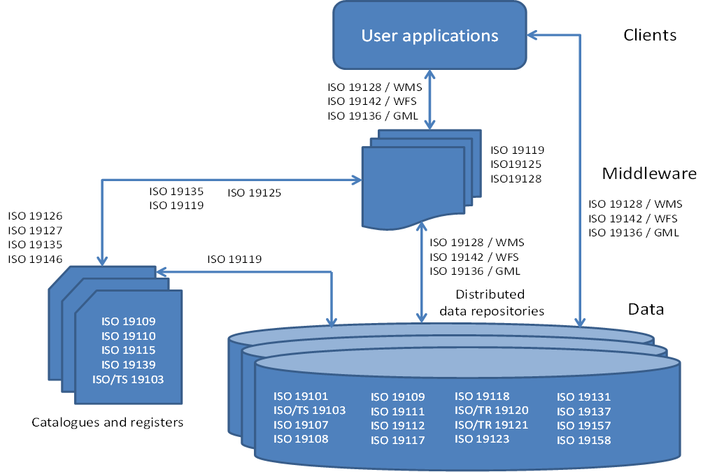

# Estándares ISO

## Qué es ISO?

ISO (International Organization for Standarization) es una organización internacional dedicada a la elaboración de estándares no solo en el ámbito geográfico, sino en todas las áreas. ISO es responsable, por ejemplo, de estándares bien conocidos y aplicados en la industria actual, tales como los relacionados con la gestión medioambiental en empresas o los estándares de calidad. [^1]

Existe una estrecha relación entre ISO y OCG. Estas dos organizaciones intentan armonizar su trabajo de manera que tanto las especificaciones de OGC como los estándares ISO acaben siendo iguales (en algunos casos ya lo son).

## Familia ISO19x

ISO tiene el Comité Técnico TC211, que se encarga de definir una serie de estándares geográficos comparables a las especificaciones abstractas de OGC (familia de estándares 19100).

Para la creación de metadatos (tanto de datos como de servicios), ISO ha creado los siguientes estándares: ISO 19115, ISO 19119 y ISO 19139; mientras que para el diseño de geoservicios, OGC ha diseñado los siguientes: WMS, WFS, WCS, GML. Algunos de estos han sido adoptados también por ISO, convirtiéndose así en estándares internacionales.

Los servicios de catálogo que defiende OGC están basados en especificaciones estándar de implementación y en estándares internacionales (desarrollados por ISO), para garantizar las búsquedas distribuidas en diferentes bases de datos.

*Algunos de los estandares más importantes de las IDEs (Basado en Smits et al., 2002)*
### ISO 19115 (Metadatos)

Esta norma internacional proporciona un modelo y establece un conjunto común de terminología, definiciones y procedimientos de aplicación para los metadatos. Mediante la definición de elementos de metadatos se va a poder describir la información sobre la identificación, la extensión, la calidad, el modelo espacial y temporal, la referencia espacial y la distribución de los datos geográficos.

El objetivo de este estándar es proporcionar un procedimiento claro para la descripción del conjunto de datos geográficos, de forma que los usuarios puedan determinar si los datos les serán útiles y como acceder a ellos.

La Norma Internacional ISO 19115-1:2014 *"Geographic Information Metadata Part 1 Fundamentals"* tiene como objetivo proporcionar un modelo para describir información o recursos que pueden tener una extensión geográfica.

La Norma ISO 19115-2:2009 *"Información Geográfica Metadatos Extensión para imágenes y datos malla"* es un complemento de la ISO 19115-1 y define los elementos de metadatos adicionales necesarios para describir adecuadamente las imágenes geográficas y los datos malla (*raster*).

Una importante fuente de información utilizada en los Sistemas de Información Geográfica son las imágenes de satélite, orto-fotografías, modelos digitales, etc. Estos datos de tipo ráster y malla poseen características intrínsecas particulares, que deben quedar reflejadas mediante los metadatos. A pesar de que la norma ISO 19115 contiene algunos elementos destinados a documentar estetipo de información, éstos resultan escasos para documentar de forma correcta y completa la información ráster y por ese motivo se creo la ISO 19115-2.

El objetivo de esta norma es definir los metadatos asociados a datos ráster y malla que van a contener información sobre: 

* Las propiedades de los equipos de medición usados para adquirir los datos. 
* La geometría de los procesos de medición empleados por los equipo.
* Los procesos de producción usados para obtener los datos.
* Los métodos numéricos y procesos informáticos usados. 

La Norma ISO/TS 19115-3:2016 *"Información Geográfica Metadatos Parte 3 Implementación de esquemas XML para conceptos fundamentales"* establece los esquemas XML necesarios para implementar el modelo de metadatos abstracto que define ISO 19115 de modo que gracias a esta especificación técnica se pueden crear los registros de metadatos en formato XML que son interoperables a través de Internet y compatibles independientemente de la herramienta de creación que se utilice.

Se aplica a diferentes niveles de información conjuntos de datos geográficos, series de conjunto de datos, fenómenos geográficos individuales, propiedades de los fenómenos, etc

[^2]
*Ejemplos prácticos de elemenentos a los que se puede aplicar la norma.*

Esta Norma de Metadatos es de una gran complejidad e incluye una extensa serie de elementos de metadatos, unos obligatorios y otros opcionales. El documento consta de 140 páginas, incluye un total de 409 ítems y define 27 listas controladas, mediante las que se definen los posibles valores válidos de ciertos campos.

Aunque esta norma define un extenso número de elementos de metadatos, establece un “conjunto mínimo” de metadatos (el núcleo o Core), a considerar para todo el rango de aplicaciones de los metadatos (desde mapas en formato papel a datos en formato digital, comoimágenes satélite, modelos digitales del terreno, etc.). Con este conjunto se pretende establecerunos mínimos para facilitar el descubrimiento, el acceso, la transferencia y la utilización de los datos. Este núcleo está formado por elementos obligatorios y otros opcionales que usados todos ellos aumenta la interoperabilidad de los datos y permite a los usuarios entenderlos sin ambigüedades. Todo perfil que se defina a partir de esta norma debe estar formadocomo mínimo por los elementos definidos en dicho núcleo. 

Principales elementos del Core de ISO 19115.

* Título del Conjunto de Datos
* Fecha de Referencia
* Idioma del Conjunto de Datos
* Resumen descriptivo
* Fecha de los Metadatos
* Categoría del tema
* Parte responsable del Conjunto de Datos
* Resolución espacial del conjunto de datos
* Formato de Distribución
* Extensión vertical y temporal
* Tipo de representación espacial
* Sistema de Referencia
* Linaje
* Recurso en línea
* Identificador del Fichero de Metadatos
* Norma de Metadatos
* Versión de la Norma de Metadatos
* Punto de contacto para los Metadatos
* Localización geográfica de los Datos

### ISO 19119 (Servicios)

El estándar internacional ISO 19115 aporta la información necesaria para describir los conjuntos de datos espaciales se completa con el estándar ISO 19119:2005 *Geographic Information -Services* para describir los servicios de datos espaciales a través de sus metadatos.

La ISO 19119 proporciona un entorno de trabajo para el desarrollo de software que permite a los usuarios el acceso y procesamiento de datos geográficos procedentes de diversas fuentes, a través de interfaces genéricos dentro de un entorno tecnológico abierto.

La arquitectura de servicios geográficos especificada en ISO 19119 ha sido desarrollada para conseguir los siguientes propósitos:

* Proporcionar un entorno de trabajo para permitir el desarrollo coordinado de servicios específicos.
* Permitir la interoperabilidad entre servicios a través del uso de estándares de interfaces.
* Facilitar el desarrollo de catálogos de servicio a través de la definición de metadatos de servicio.
* Permitir la separación de instancias de datos e instancias de servicios.
* Permitir el uso de un servicio de un proveedor con datos de otro proveedor.
* Definir un entorno de trabajo abstracto que pueda ser implementado de múltiples formas.

### ISO 19139 (Metadatos. Especificación de Implementación)

La ISO 19139 (*“ISO/TS 19139-Geographic Information-Metadata -XML schema implementation”*) está diseñada para proporcionar una especificación común para la descripción, la validación y el intercambio de conjuntos de datos geográficos, lo cual permitirá promover la interoperatividad y aprovechar las ventajas de la ISO 19115 en especificaciones de implementación concretas.

La norma ISO 19115 proporciona una estructura para describir información geográfica mediante elementos de metadatos y establece una terminología común para los mismos pero no desarrolla como poder llevar a cabo su implementación [^2]. La ISO 19139 proporciona unas normas claras de implementación de metadados para los conjuntos de datos geográficos digitales.

ISO 19139 es una especificación técnica que desarrolla una implementación en XML (Esquema XML) del modelo de metadatos descrito por ISO 19115.

Un archivo de intercambio de metadatos, acorde con el estándar ISO19115 y en formato XML, va a ser un documento XML que siga la sintaxis definida por la especificación técnica ISO 19139. Es decir, esta especificación técnica define un conjunto de esquemas en XML quevan a describir los metadatos asociados a cada nivel de información, permitiendo así su descripción, asegurando su validación y su posterior intercambio a través de archivos de metadatos.

## Referencias

[^1]: https://github.com/volaya/libro-sig/releases/download/v3.0/Sistemas.de.Informacion.Geografica.pdf
[^2]: https://www.iaaa.es/curriculum/08-Publicaciones-Articulos/art_2008_Mapping_Normas.pdf
