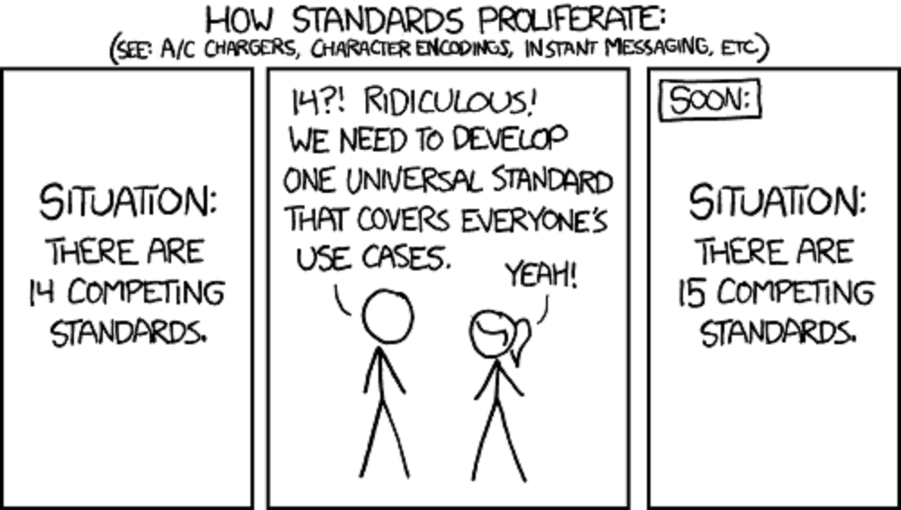
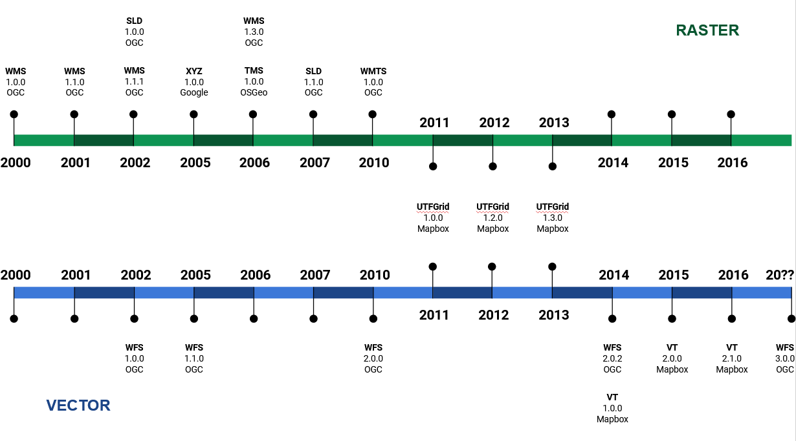

# Estándares OCG
    
## Qué es OGC?

El OGC (Open Geospatial Consortium fué creada en 1994 y está formada por más de 500 empresas, agencias gubernamentales y universidades. Es una organización internacional sin ánimo de lucro comprometida con la elaboración de estándares abiertos e interoperables de calidad para la comunidad geoespacial global. 

Estos estándares se elaboran a través de un proceso de consenso y están disponibles de forma gratuita para que cualquier persona pueda utilizarlos para mejorar el intercambio de los datos geoespaciales del mundo.

Estas especificaciones tienen como objetivo, fomentar la interoperabilidad geoespacial. El éxito de estas especificaciones radica en el hecho de que son impulsadas y creadas por las mismas empresas, que después las implementan en sus productos comerciales. 

### Interoperabilidad

Se puede definir la interoperabilidad como la habilidad de dos o más sistemas para intercambiar información y poderla utilizar, sin ningún esfuerzo por parte del usuario. Las modalidades de interoperatividad dependen de los agentes que interaccionan. Dicho de otra manera, los datos producidos en un entorno operativo tienen que poder ser leídos e interpretados por otro entorno sin que el usuario tenga que hacer una conversión de formatos.

La interoperabilidad permite:

* Acceder a más y mejor información (topográficos, ortoimágenes, callejeros, catastro, medio ambiente...), sin tener que disponer de un software específico o directamente desde el navegador. Esto permite que el usuario pueda acceder a cartografía de varias fuentes, con arquitecturas diferentes, de una forma fácil y transparente.

* Facilita el acceso a geoservicios.

## Estándares OGC

Un estándar es un modelo, un patrón que tiene como finalidad la fijación de unas normas comunes para garantizar la homogeneidad en el proceso de producción. Pero para que tenga éxito tiene que tener un uso mayoritario. 

*Estándares*

Para conseguir que, tanto la documentación de los datos como la creación de servicios sea comprensible y accesible para todo el mundo, es decir, para hacer que todos “hablemos el mismo idioma”, se han diseñado estándares de metadatos y de servicios que pretenden poner en común los puntos de vista de los diferentes productores. Por lo tanto, la estandarización consiste en hacer que, tanto la documentación de datos como la creación de geoservicios, así como su acceso, se hagan conforme a unas norma previamente establecidas. 

Los estándares de la OGC son documentos de carácter técnico dónde se describen las interfaces de comunicación entre servidores y la forma de implementarlos.

En estas especificaciones no se menciona ni la arquitectura, plataforma o lenguajes de programación a utilizar. 

Los documentos, antes de ser consideradas como una OpenGIS Implementation Specification, son elaborados y probados por diferentes grupos de trabajo dentro de OGC y finalmente sometidas a votación.

Los servicios de cartografía online o web de OGC (OWS) son estándares de OGC creados para su uso en aplicaciones de la World Wide Web (WWW). Estos permiten formular peticiones al servidor para: enviar preguntas, obtener datos vectoriales o raster, hacer geoprocesos, etc.   

Todos los estándares creados por OGC se pueden consultar en [https://www.ogc.org/docs/is](https://www.ogc.org/docs/is)

Para la comunidad de habla hispana y portuguesa interesada en los desarrollos y objetivos de OGC se ha creado el Foro Ibérico y Latinoamericano de OGC ([OGC ILAF](https://external.ogc.org/twiki_public/ILAFpublic/WebHome)).

*Evolución de servicios OWS*

[Evolución de servicios OWS](https://gss-mtig.github.io/servicios-ows/)

Listado de los principales estándares OGC relacionados con las IDE's

* [WMS](https://gss-mtig.github.io/sdis-mgeo/wms/)
* [WMTS](https://gss-mtig.github.io/sdis-mgeo/wmts/)
* [WFS](https://gss-mtig.github.io/sdis-mgeo/wfs/)
* [GML](https://gss-mtig.github.io/sdis-mgeo/gml/)
* [SLD](https://gss-mtig.github.io/sdis-mgeo/sld/)
* [SOS](https://gss-mtig.github.io/sdis-mgeo/sos/)
* [CWS](https://gss-mtig.github.io/sdis-mgeo/csw/)
* [API](https://gss-mtig.github.io/sdis-mgeo/api/)
* [Otros](https://gss-mtig.github.io/sdis-mgeo/otros/)

## Recursos 

https://www.ogc.org/standards/

https://www.idee.es/web/guest/rincon-del-desarrollador
