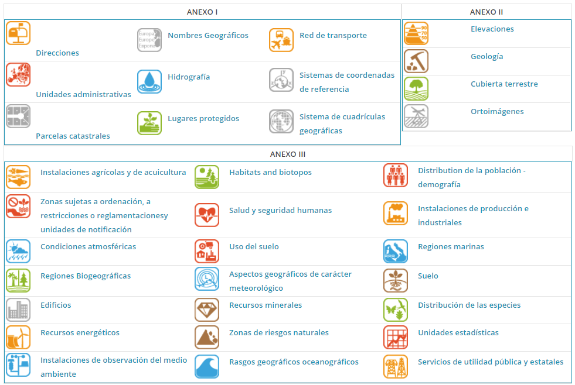

# INSPIRE

[INSPIRE (INfrastructure for SPatial InfoRmation in Europe)](https://inspire.ec.europa.eu/) tiene por objetivo hacer disponible una información geográfica de calidad, armonizada y relevante para apoyar la formulación, la implementación, la monitorización y la evaluación de las políticas comunitarias con un impacto o dimensión territorial.

INSPIRE es una iniciativa legal de la UE que dirigirá protocolos y estándares, aspectos de coordinación y organización, políticas de datos incluyendo el acceso a los datos y la creación y el mantenimiento de la información espacial.

El 17 de noviembre de 2003, el Parlamento Europeo aprobó la Directiva 2003/98 CE, en lo referente a la reutilización de la información del sector público. Su finalidad es fijar un marco legal que armonice el uso y la explotación de la información del sector público (condiciones de reutilización, formatos disponibles, principios de tarificación, transparencia, etc.), fomentando así un mercado interior entre todos los estados miembros.

La nueva directiva se dirige claramente a facilitar información desde las Entidades Públicas hacia el sector privado, que puede darle un amplio valor añadido a. De manera especial favorecerá la difusión de información geográfica, dado que las administraciones públicas son el principal generador de este tipo de información. Lo que puede reforzar iniciativas IDE, entre muchas de otras.

Para asegurar que las infraestructuras de datos espaciales de los Estados miembros sean compatibles e interoperables en un contexto comunitario y transfronterizo, la Directiva exige que se adopten Normas de Ejecución comunes Implementing Rules) específicas para las siguientes áreas metadatos, conjuntos de datos, servicios de red, servicios de datos espaciales, datos y servicios de uso compartido y seguimiento e informes Estas normas son de obligado cumplimiento en cada uno de los países de la Unión

La Directiva INSPIRE se aplica en diferentes etapas hasta el 2021 que deberá tener aplicación plena

Es el primer paso de una amplia iniciativa multisectorial, que inicialmente se centrará en la información espacial necesaria para las políticas medio ambientales y que estará abierta a las necesidades de otras áreas políticas como la agricultura y el transporte.

La situación general respecto a la información espacial en Europa es de fragmentación de datos y fuentes. Hay lagunas en la disponibilidad de los datos, carencia de harmonización entre conjuntos de datos en las diferentes escalas y sistemas de referencia y duplicación de la información. Estos problemas hacen difícil la identificación, el acceso y el uso de los datos disponibles.

Afortunadamente, está creciendo la conciencia sobre la necesidad de una información georeferenciada de calidad para entender mejor las relaciones humanas con su entorno.

La iniciativa tiene la intención de crear una infraestructura europea de datos espaciales que dé servicios de información espacial integrada a los usuarios. Estos servicios tendrán que permitir a los usuarios identificar y acceder a la información geográfica de muy variadas fuentes, garantizando la interoperatividad. Los posibles servicios son la visualización de capas de información, la superposición de información procedente de diferentes fuentes, el análisis espacial y temporal, etc.

## Principios de INSPIRE

* Los datos tienen que recogerse una sola vez y conservarse en el nivel donde resulten más eficaces.
* Tiene que ser posible combinar, sin problemas de continuidad, la información geográfica procedente de diferentes fuentes europeas y ponerla al alcance de los usuarios y aplicaciones.
* La información recogida a un nivel tiene que poder ser compartida a todos los niveles, la información a gran escala para investigaciones detalladas, y la de pequeña escala para finalidades estratégicas.
* La información geográfica necesaria a todos los niveles tiene que ser abundante sin limitar su uso extensivo
* Tiene que ser sencillo descubrir qué información geográfica está disponible, si cubre las necesidades para un uso determinado y bajo qué condiciones se puede adquirir y utilizar
* Los datos geográficos tienen que ser fáciles de entender y de interpretar porque tienen que estar adecuadamente documentados

## Temas INSPIRE

https://blog-idee.blogspot.com/2012/10/indice-de-temas-inspire.html?m=1

https://inspire.ec.europa.eu/Themes/Data-Specifications/2892

*Temas anexos INSPIRE*

## Calendario de implementación INSPIRE

Para tener metadatos de datos y servicios conforme al Reglamento INSPIRE de metadatos

| Anexo I    | Anexo II   | Anexo III  |
|------------|------------|------------|
| 03/12/2010 | 03/12/2010 | 03/12/2013 |

Para tener servicios de visualización y catálogo

| Anexo I    | Anexo II   | Anexo III  |
|------------|------------|------------|
| 02/11/2011 | 09/11/2011 | 03/12/2013 |

Pare tener servicios de descarga y transformación (cuando sea necesario)

| Anexo I    | Anexo II   | Anexo III  |
|------------|------------|------------|
| 28/12/2012 | 28/12/2012 | 03/12/2013 |

Para tener los datos conforme a las especificaciones INSPIRE

Conjunto de datos nuevos (producidos después del 8/12/2010)

| Anexo I    | Anexo II   | Anexo III  |
|------------|------------|------------|
| 23/11/2013 | 21/10/2015 | 21/10/2015 |

Conjunto de datos existentes (producidos antes del 8/12/2010)

| Anexo I    | Anexo II   | Anexo III  |
|------------|------------|------------|
| 23/11/2017 | 21/10/2020 | 21/10/2020 |

Como podemos ver ya los plazos límites se han terminado y todavía queda mucho por hacer por parte de las adminsitraciones para cumplir con las normativa. 

Existe un procedimiento que se puede seguir en caso de incumplimiento. Para más detalles https://www.idee.es/resources/documentos/20160209INFORME_SOBRE_EL_ALCANCE_DE_LA_DIRECTIVA_INSPIRE__INCUMPLIMIENTO.pdf

## Servicio de descargas

El servicio de descargas INSPIRE basado en [**ATOM**](https://es.wikipedia.org/wiki/Atom_(formato_de_redifusi%C3%B3n)) proporciona una forma simple para publicar información en la web de forma de fuentes (**feeds**). El *feed* es un documento basado en XML y permite la búsqueda de actualizaciones del contenido publicado en una web. Una fuente puede tener entradas de diversos tipos: textos, imágenes y en el caso de los servicios de descarga conjutos de datos espaciales.

La guía técnica publicada propone la utilización del estándar OpenSearch para la implementación del mecanismo de búsqueda. [Open Search](https://www.opensearch.org/) permite especificar, mediante un fichero XML, las operaciones y sus parámetros de forma estructurada e interoperable y siendo reconocido por los navegadores más importantes.

Es es una práctica común que para facilitar la organización y utilización se establezcan 2 nivles de acceso a los ficheros ATOM. Un primer nivel donde se definen las entradas (*sub-feeds*) de la lista de fuentes *Dataset feed* de los distintos productos y un segundo nivel donde se encuentran los distintos enlaces de descarga de los *dataset*.

Una ventaja que tienen los servicios de descarga ATOM sobre los basados en WFS es que es una alternativa más sencilla para conjuntos de datos predefinidos, ya que es más fácil de implementar, implica menos recursos y no necesita de software específico.

*Diagrama ejemplo servicio ATOM Fuente: Comisión Europea, 2013 (Technical Guidance for the implementation of
INSPIRE Download Services)*[^1]

Ejemplos de servicios ATOM.

* https://www.catastro.minhap.es/webinspire/index.html
* https://inspire.larioja.org/
* https://www.diba.cat/es/web/idebarcelona/serveis-descarrega-atom
* https://www.miteco.gob.es/es/cartografia-y-sig/ide/descargas/atom.aspx

Pluggin de QGIS para descarga de datos catastrales de España https://github.com/sigdeletras/Spanish_Inspire_Catastral_Downloader

## Referencias

[^1]: https://www.ign.es/resources/acercaDe/libDigPub/Libro-IDE-2020.pdf