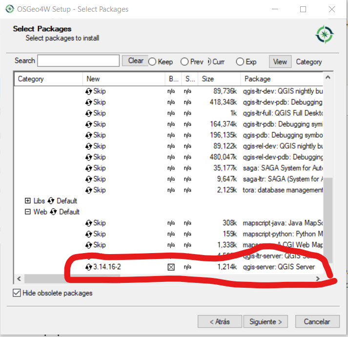

# Instalación de programas

## XAMP

XAMPP es una distribución de Apache fácil de instalar que contiene MariaDB, PHP y Perl. Simplemente descarga y ejecuta el instalador. ¡Es así de fácil!

Descargar la última version de XAMPP desde https://www.apachefriends.org/download.html

Descarga XAMPP

Ejecutar el archivo descargado.

En el formulario seleccionar todos los componentes

Componentes XAMPP

!!! warning
    Debido a que en los ordenadores de la UAB no se permite instalar software de forma permanente se debe instalar el XAMPP en la unidad de trabajo.

Siguiente -> Siguiente para el resto de opciones del asistente.

## QGIS Server

Descargar el instalador OsGeo4W que es una distribución binaria que contiene un gran número programas geoespaciales de código abierto para entornos Windows (desde Windows 10 hasta XP). OSGeo4W incluye QGIS, GDAL/OGR, GRASS, SAGA así como muchos otros paquetes (más de 150).

El primer paso es acceder a la [sección de descargas de la página web de QGIS](https://qgis.org/es/site/forusers/download.html) y seleccionar la opción de OSGeo4W Instalador en red (64 bit).

Descarga OSGeo4W

Para personalizar nuestra instalación seleccionaremos la opción **Advanced Install**.

Instalación OSGeo4W

La siguiente ventana nos pide seleccionar una fuente de descarga. Lo normal es descargar e instalar los programas en el momento en el que lanzamos el instalador, por lo que seleccionaremos la opción **Install from Internet**.

A continuación se nos pide seleccionar el destino de la instalación, instalar los programas para todos los usuarios y opcionalmente crear un icono en el escritorio de nuestro PC.

!!! warning
    Debido a que en los ordenadores de la UAB no se permite instalar software de forma permanente se debe instalar el en la unidad de trabajo.

Siguiente -> Siguiente para el resto de opciones del asistente hasta llegar a la ventana **Select Packages**. Desde esta ventana podemos seleccionar qué programas queremos descargar e instalar:

Despliega la categoría **Web** y pincha sobre *qgis-server: QGIS Server*

Selección QGIS Server

Siguiente -> Siguiente para el resto de opciones del asistente.

### Configurar el Apache

Editar el archivo *httpd.conf*. En el caso del XAMPP lo hacemos desde el panel de control.

Apache config file

Se abre el archivo *httpd.conf* con el editor de texto y debemos cambiar lo siguiente

**ScriptAlias**

Cambiar la línea:

    ScriptAlias /cgi-bin/ "C:/xampp/cgi-bin/"

por:

    ScriptAlias /cgi-bin/ "c:/OSGeo4W64/apps/qgis/bin/"

**QGIS Server configuration**

Cambiar la líneas:

    <Directory "C:/xampp/cgi-bin"
        AllowOverride None
        Options None
        Require all granted
    </Directory>

por:

    <Directory "c:/OSGeo4W64/apps/qgis/bin">
        SetHandler cgi-script
        AllowOverride None
        Options ExecCGI
        Order allow,deny
        Allow from all
        Require all granted
    </Directory>

**Cgi handler**

Cambiar la línea:

    AddHandler cgi-script .cgi .pl .asp

por:

    AddHandler cgi-script .cgi .pl .exe

**Variables**

Al final del archivo escribir:

    SetEnv GDAL_DATA "C:\OSGeo4W64\share\gdal"
    SetEnv QGIS_AUTH_DB_DIR_PATH "C:\OSGeo4W64\apps\qgis\resources"
    SetEnv PYTHONHOME "C:\OSGeo4W64\apps\Python37"
    SetEnv PATH "C:\OSGeo4W64\bin;C:\OSGeo4W64\apps\qgis\bin;C:\OSGeo4W64\apps\Qt5\bin;C:\WINDOWS\system32;C:\WINDOWS;C:\WINDOWS\System32\Wbem"
    SetEnv QGIS_PREFIX_PATH "C:\OSGeo4W64\apps\qgis"
    SetEnv QT_PLUGIN_PATH "C:\OSGeo4W64\apps\qgis\qtplugins;C:\OSGeo4W64\apps\Qt5\plugins"

### Test

Reiniciar el Apache y abrir una petición GetCapabilities a nuestro servidor

Abrir en el navegador http://localhost/cgi-bin/qgis_mapserv.fcgi.exe?SERVICE=WMS&VERSION=1.3.0&REQUEST=GetCapabilities

Deberíamos ver un XML de un WMS Capabilities

## Geonetwork

GeoNetwork es una aplicación de catálogo para administrar recursos referenciados espacialmente. Proporciona potentes funciones de búsqueda y edición de metadatos, así como un visor de mapas web interactivo. Actualmente se utiliza en numerosas iniciativas de infraestructura de datos espaciales en todo el mundo.

Para descargar el Geonetwork abrimos la página https://geonetwork-opensource.org/downloads.html y seleccionamos la versión [v3.10.4 (Current release)](https://sourceforge.net/projects/geonetwork/files/GeoNetwork_opensource/v3.10.4/). En la página de descarga seleccionamos el **geonetwork.war**

Descarga Geonetwork

Lo siguiente que debemos hacer es mover el archivo descargado geonetwork.war dentro de la carpeta del tomcat. Para ello ubicamos la carpeta **tomcat/webapps** (*C:\xampp\tomcat\webapps*) dentro de la carpeta de instalación del XAMPP y copiamos el archivo geonetwork.war en esta carpeta

Abrimos el panel de control del XAMPP e iniciamos el Tomcat. Se abre una nueva ventana del terminal donde vemos el proceso de despliegue de la aplicación de Geonetwork dentro del Tomcat.

Desplegar Geonetwork

Abrir el navegador y escribir http://localhost:8080/geonetwork/ y se debería ver la pantalla de inicio de Geonetwork

Pantalla inicio Geonetwork
