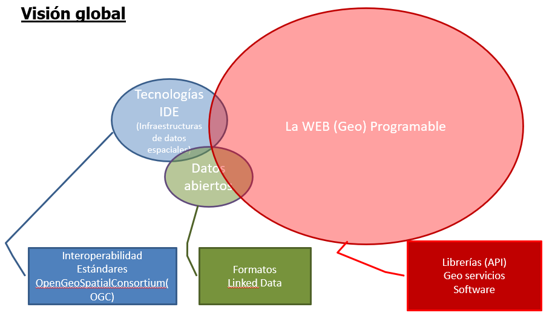

# Introducción a las IDE's

Temario

* Antecedentes
* Qué es una IDE?
* Componentes de una IDE
* IDEC
* IDEE
* INSPIRE
* Otras IDES

Tradicionalmente, la obtención de información geográfica ha estado caracterizada por una serie de dificultades (formatos, precios, dónde buscarla...), ya que está muy dispersa y en diferentes formatos.

No obstante, el desarrollo de tecnologías de la información y la mejora de las comunicaciones tiene que permitir salvar todos estos obstáculos y facilitar el acceso tanto a la información del sector público como privado amparándose en unas políticas de consenso y en un marco legal establecido. Si a todo esto le sumamos el uso de herramientas desarrolladas con tecnologías estándar las posibilidades de búsqueda, acceso y intercambio de información son infinitas.

La información geográfica es uno de los elementos más esenciales en la toma de decisiones, así como uno de los más costosos (entre un 70 y un 80% de los costes de un proyecto SIG están destinados a la compra y/o mantenimiento de los datos). Esta información está concentrada mayoritariamente al sector público (se estima que entre un 80 y un 90% de la información geográfica es generada por administraciones públicas). El hecho de no conocer la información disponible, hace que los datos puedan ser comprados una y otra vez por diferentes administraciones, aumentando innecesariamente el coste de los proyectos.

## Antecedentes

En 1987, el comité Chorley, del Departamento de Medioambiente de Estados Unidos, concluyó que *las barreras políticas e institucionales que restringen actualmente el uso de los SIG deben ser superadas. Esto incluye problemas de incompatibilidad por diferencias de definición y formatos, así como restricciones al acceso y adquisición de los propios datos.*

En la conferencia de las Naciones Unidas sobre medio ambiente y desarrollo que tuvo lugar en en Río de Janeiro en 1992. Entre los muchos temas a debate en esta reunión, uno de especial relevancia fue el papel de la información geográfica para tratar los problemas acerca de los cuales se debatía (protección medioambiental, cooperación internacional, desarrollo, etc.). Quedó claro en aquel momento que establecer mecanismos para afrontar esos problemas pasaba necesariamente por instaurar de forma paralela mecanismos que permitieran aprovechar mejor la información geográfica y lograr una mayor coordinación entre las organizaciones estatales encargadas de su manejo.[^1]

El concepto IDE nace en los años noventa como una voluntad política en Estados Unidos para garantizar la interoperabilidad entre la información geográfica generada por las diferentes agencias federales.

La primera IDE se implantó a mediados de los 90, cuando EEUU inició el desarrollo de herramientas de acceso a datos, precursoras de las IDE Nacionales, para coordinar el desarrollo, uso, intercambio y la difusión de la cartografía topográfica y los datos espaciales relacionados.

En 1994, Bill Clinton aprobó la Orden Ejecutiva 12906 dónde decía:
> *"La información geográfica es vital para a promover el desarrollo económico, aprovechar nuestros recursos naturales y proteger el medio ambiente. La tecnología moderna permite mejorar la adquisición, distribución y utilización de datos geográficos y cartográficos. La Revisión del Desarrollo Nacional, ha recomendado que la rama ejecutiva desarrolle, en cooperación con los estados, los gobiernos locales y el sector privado, una Infraestructura Nacional de Datos Espaciales para a apoyar las aplicaciones de los datos geoespaciales en el sector público y privado, en áreas como el transporte, el desarrollo comunitario, la agricultura, la atención de emergencias, la gestión ambiental y la tecnología de información".*

En 1996 se celebra la 1ª Conferencia Internacionla del GSDI (Global Spatial Data Infrastructure).

Otros países iniciaron los primeros pasos con los mismos objetivos. Los países que habían implementado IDE de primera generación, se replantean la iniciativa y la van actualizando y modificando, adaptándola a las necesidades del momento (se puede situar en el año 2000). Esto trajo un rápido incremento de nuevos países que se implicaron en el proceso de creación de infraestructuras de datos (el año 2002, 120 países habían iniciado o iniciaban proyectos IDE) y la aparición de una comunidad IDE, en la cual se podían compartir e intercambiar experiencias.

En 2004 se consolida tras la constitución formal de la GSDI.

## Qué es una IDE?

Existen varias definiciones para describir IDE, pero una de las mas utilizada y extendida es la elaborada por la Federal Geographic Data Committee (FGDC) que la define como: *Una Infraestructura de Datos Espaciales (IDE) se puede definir como un conjunto de tecnologías, políticas, estándares y recursos humanos necesarios para a adquirir, procesar, almacenar, distribuir y mejorar la utilización de la información geográfica - Federal Geographic Data Committee (FGDC)*

Una IDE (Infraestructura de Datos Espaciales) es un sistema informático integrado por un conjunto de recursos (catálogos, servidores, programas, datos, aplicaciones, páginas Web,...) dedicados a gestionar Información geográfica disponibles en Internet, que cumpla una serie de condiciones de interoperabilidad. [^2]

A partir de estas definiciones podemos vislumbrar que una IDE no es solo una implementación tecnológica sino que comprende una parte muy importante de comunicación, no precisamente entre servidor-servidor, sino entre Institución—Instituciones, departamento—departamento, en definitiva persona—persona para establecer los marcos de colaboración para compartir, describir y acceder a los datos geográficos.

*Esquema de una IDE* [^3]

### Comparación

Conceptualmente, las Infraestructuras de datos tienen la misma finalidad que las carreteras y las autopistas: mejorar la comunicación, facilitar el acceso, incrementar el comercio, etc.

| Infraestructura de tránsito                                     | Infraestructura de datos espaciales                                                          |
|-----------------------------------------------------------------|----------------------------------------------------------------------------------------------|
| Objetivos: mejorar la accesibilidad y el uso de los coches      | Objetivos: mejorar el acceso, el uso de la Geoinformación y evitar duplicaciones de datos    |
| Red de transporte (carreteras, caminos, puentes, etc.)          | Internet                                                                                     |
| Vehículos                                                       | Datos                                                                                        |
| Ayudas: mapas, carteles, señales                                | Catálogos (datos y servicios)                                                                |
| Conductores                                                     | Usuarios                                                                                     |
| Taller / Garaje (Servicios)                                     | Webservices (geoservicios)                                                                   |
| Parking                                                         | Almacén de geodatos de los proveedores                                                       |
| Fabricante de coches                                            | Proveedores de datos y servicios                                                             |
| Código de circulación                                           | Estándares                                                                                   |
| Regulación tránsito                                             | Política + Lesgislación                                                                      |
| Política (Centro de control de tránsito)                        | Marco institucional (Centro de Geodatos)                                                     |

Una buena infraestructura viaria proporciona una mejor accesibilidad, de lo que se deriva una mejor comunicación entre regiones y, por tanto, un incremento del comercio. Esta es precisamente, la finalidad de las IDE: facilitar el acceso y el uso de la información geográfica y fomentar su comercio.

## Componentes de una IDE

Una IDE está compuesta de 5 elementos fundamentales:

* **Marco institucional** Organización
* **Datos** y **Metadatos** Descriptores de les datos
* **Geoservicios** Visualización y acceso a los datos
* **Usuarios** y colaboradores
* **Estándares**

*Componentes de una IDE* [^3]

#### Marco institucional

Para que una IDE pueda prosperar tiene que contar con un suporte institucional firme que garantice su impulso inicial. Este suporte se tiene que plasmar con un marco legal adecuado, que anime a las diferentes administraciones públicas o entidades a participar en las activitades de la IDE.

Por ejemplo la directiva europea INSPIRE y la ley española LISIGE se han eleborado de forma participativa. Estos marcos legales cumplen la función de consolidar las reglas acordadas por la comunidad para dar seguridad jurídica y sostenibilidad al proyecto. Debe ser un marco jurídico mínimo neceario para que se desarrollen con garantías las IDEs haciendo que no todo dependa de la buena voluntad de las partes implicadas. 

#### Los datos y sus descriptores

Cualquier tipo de data que de forma directa o indirecta haga referencia a una localización se podría definir como dato geográfico.

Las administraciones públicas son las propietarias de la mayoría de la información geográfica de referencia para lo cual, asegurando su implicación garantizamos una cartografía de base esencial para el desarrollo de la IDE.

Los datos, por si solos, no nos aportan demasiada información. Por este motivo, es necesaria su descripción. Los **metadatos** describen el contenido y las características de los datos o servicios, aportando una información muy valiosa que ayuda a “contextualizar” el dato, y en ocasiones, facilitar su acceso. Estos metadatos tienen que ser: almacenados en un *Catálogo* on line, consultable para a cualquier usuario, y descritos según unos estándares que aportan las pautas de cómo y qué información hay que dar en cada caso.

#### La visualización y el acceso a los datos

El intercanvio de información y la interoperatividad de los sistemas son dos conceptos clave en una IDE. Ambos se pueden conseguir gracias a los estándares y los geoservicios. OGC ha desarrollado una serie de especificaciones estándar que permiten a dos sistemas diferentes, con arquitecturas y formatos de datos diversos combinar cartografía sin ningún esfuerzo por parte del usuario.

Para fácilitar la visualización y el acceso a los datos los encargados del desarrollo de la IDE generalmente implementan un *Geoportal* que incluye entre otras cosas:

* Metadatos (descripción del contenido, la cualidad y otras características de los datos)
* Catálogo (publicación en Internet de los metadatos de datos, servicios y esquemas)
* Servicio de acceso a datos y servicios (clientes, visores)
* Servidores de mapas con proveedores de información
* Servicios de geoprocesamiento (procesos informáticos que manipulan y transforman datos geoespaciales: transformaciones de coordenadas, de proyecciones, análisis espacial...)
* Conexiones a otras IDE's.

#### Los usuarios y colaboradores

Para que una IDE se pueda considerar como tal, tiene que haber unos usuarios que la usen, en este sentido la tarea de difusión es muy importante. A medida que se incrementa su uso, las empresas empiezan a ver las posibilidades comerciales y a implicarse en el proyecto, acelerando así el crecimiento de la IDE.

Una comunidad IDE esta integrada por varios actores como: productores de datos, proveedores de servicios, usuarios, desarrolladores, invertigadores, etc. Cuanto más abierta y colaborativa sea la comunidad mayor calidad tendrá la IDE. La idea es que incluya organizaciones públicas, privadas, universidades y particulares. Por el momento esta comunidad está formada principalmente por administraciones públicas.

##### Conclusiones

Para poder poner en marcha una IDE es necesario disponer de:

* **Componente político**, responsable de fomentar esta iniciativa y que determine las actuaciones legales que establezcan el marco y regulen su desarrollo.
* **Componente tecnológico**, para que este sistema funcione a través de Internet. Para ello, es necesario que exista una comunicación efectiva entre los usuarios y los servidores por medio de una arquitectura conocida como “cliente-servidor”.
* **Componente geográfico**, formado por los conjuntos de datos y servicios web geográficos que se proporcionan a través de una IDE, así como los registros de metadatos que los describen.
* **Componente social**, que se corresponde con un conjunto de actores, cada uno de ellos con un rol determinado, interesados en su puesta en marcha, ya sea por el hecho de ser productor de datos, de software o por pertenecer a las comunidades de difusión responsables de formar en la filosofía IDE. Este componente es necesario para que una IDE permanezca y se consolide con el paso del tiempo y en consecuencia, consiga el éxito de esta iniciativa en la sociedad.

### Principios en que se basa el dearrollo de una IDE

1. Datos recogidos una vez y mantenidos en el nivel donde se logra máxima
efectividad
    * Quien genera, y sobre todo mantiene, un tipo de datos debe encargarse de organizarlos en una base de datos y facilitar el acceso a ellos mediante los servicios adecuados
    * No deben duplicarse los mismos datos en bases de datos distintas que no aseguren exactamente el mismo nivel de actualización

2. Debe ser posible combinar IG con total continuidad para un ámbito territorial extenso desde fuentes diversas
    * La información geográfica en un ámbito territorial debe basarse en una información geográfica de referencia común, y acorde con la precisión de la información geográfica y en un único Sistema Geodésico de referencia
    * Debe ser posible superponer capas de información geográfica de distintas temáticas y procedencias

3. Debe ser posible compartir la IG entre usuarios y aplicaciones

4. Debe ser posible que la información recogida en un nivel o sector sea compartida por los otros

5. Debe ser fácil descubrir la información geográfica disponible, y en qué condiciones puede conseguirse y usarse
    * Metadatos
    * Calidad
    * Normas comunes

En un escenario óptimo, todo usuario de una IDE debería poder descubrir, por ejemplo, que información geográfica existe en zona concreta del territorio, visualizar esta información y finalmente, si es de su interés, descargarla.

Para llegar a esta meta, toda IDE que se precie debe:

#### Orientar su arquitectura a servicios (SOA)

Uno de los principios básicos de toda IDE es la no replicación de datos geográficos ni la creación de grandes bases de datos centralizadas. Una IDE debe fomentar un modelo distribuido dónde cada departamento o ente se responsabilice de sus datos y se encargue de describirlos y ponerlos a disposición de los demás. 

#### Implementar aplicaciones que posibiliten descubrir, visualizar y procesar información geográfica.

Entre estas aplicaciones podríamos definir un núcleo presente en toda IDE: un catálogo de metadatos, servidores de mapas y un conjunto de servicios geográficos.

#### Adoptar los estándares de interoperabilidad geoespacial para facilitar la comunicación entre componentes.

Para la descripción de los metadatos se basa en estándares ISO de la familia 19, dedicada al mundo geospacial. Pero a nivel de interfaces de comunicación entre servidores y entre clientes (ej. Un navegador web) y servidores existe un consorcio llamado OpenGeospatial (OGC) encargado de definir las especificaciones utilizadas.

Podríamos que decir que el papel que juega el consorcio W3C en cuanto a la estandarización de la Word Wide Web (www) es parecido al de OGC dentro del mundo geoespacial.

*Visión global IDE*
### La utilidad de las IDE y sus ventajas

Cuando un usuario quiere acceder a información geográfica se puede encontrar con una situación caótica, al no saber dónde ir a buscarla. A nivel de cooperación entre administraciones y empresas, la situación es también muy compleja, a causa del gran número de contactos que hay que realizar para obtener estos datos y los permisos para utilizarlos.

En un entorno IDE todo es más sencillo. Gracias a la catalogación de los datos y mediante los servidores de catálogo los usuarios pueden localizar y acceder a la información geográfica existente. La IDE se encarga también de establecer acuerdos con las administraciones con el objetivo que estas permitan la difusión de su información mediante un servicio de *webmapping*.

Ambos servicios (servidor de catálogo y webmapping) tienen que ser accesibles a través de un único portal web.

Por tanto, el uso de las IDE mejora considerablemente la dinámica del sector de la geoinformación. Otras ventajas de las IDE son:

* Facilita la toma de decisiones
* Reduce esfuerzos y costes
* Proporciona datos mejores y más actualizados
* Apoya la creación de nuevas oportunidades de negocio.

Hay que tener presente que una IDE no se tiene que ver sólo desde la vertiente tecnológica sino que existe también una vertiente social, en que los usuarios (el sector público, el privado y la población) tienen que dar su opinión, a partir de la cual se podrán determinar las estrategias a seguir. 

En el proceso de implantación de una IDE también hay que superar obstáculos técnicos (no disponibilidad de datos, de estándares, metadatos, redes de comunicación, banda ancha...), económicos, socio-culturales (conocimiento, educación, seguridad, libertad de acceso...), políticos-legales (datos delicados, propiedad intelectual...) y déficit de suporte (no se conoce la finalidad y el valor de las IDE).

Las IDE, además de mantener vías de cooperación y relaciones con el sector público y privado de la su región, tienen que hacerlo también tanto con las IDE de su nivel como con las de otros niveles

### Tareas que permite una IDE

* **Buscar** la información que hay disponible ya sea por zona geográfica, formato, año de producción, quién la ha producido, si tiene servicio, etc.
* **Visualizar** y superponer mapas, ortofotos, y datos geográficos en general de diferentes organismos, formatos, sistema de referencia, etc.
* **Buscar** una entidad geográfica por su nombre y ver su ubicación
* **Análisis** realizar opereaciones básicas, como cálculo de perfiles, análisis de superficies, etc.
* **Transformar** de un modelo de datos a otro diferente, si ambos están descritos.
* **Descargar** los datos para analizarlos con un SIG. 

### Niveles de desarrollo de una IDE

Tenemos que pensar que una IDE conlleva un factor multi-escalar en su implementación, esta puede ser implementada a nivel europeo, nivel estatal, nivel regional e incluso a nivel municipal. Cada nivel tiene la responsabilidad de interoperar con el resto de niveles

Ejemplos de niveles de desarrollo de una IDE

* Global - GSDI (Global Spatial Data Infrastructure) http://gsdiassociation.org/
* Europeo - INSPIRE INfraestructure for SPatial InfoRmation in Europe http://inspire-geoportal.ec.europa.eu/
* Nacional - IDEE (Infraestructura de Datos Espaciales de España)
http://idee.es/
* Regional - IDEC (Infraestructura de Dades Espacials de Catalunya) http://www.ide.cat
* Local - Barcelona http://w133.bcn.cat/geoportalbcn/GeoPortal.aspx?lang=es
#### IDEC

La [IDEC (Infraestructura de Dades Espacials de Catalunya)](https://ide.cat) es una iniciativa creada el año 2002 para desarrollar y mantener una Infraestructura de Datos Espaciales (IDE) en el territorio de Catalunya.

Esta infraestructura pretende facilitar y mejorar el acceso a la información y los servicios geográficos disponibles, poniendo al alcance de los usuarios herramientas para buscar, descubrir, consultar y descargar estos recursos mediante la web, para utilizarlos y explotarlos posteriormente.

El proyecto se hace posible gracias a la participación activa y colaborativa de los diferentes tipos de actores involucrados: los productores y/o proveedores de información geográfica (o espacial) y los propios usuarios. 

#### IDEE

La [IDEE (Infraestructura de Datos Espaciales de España)](https://www.idee.es/web/idee/inicio) tiene como objetivo integrar a través de Internet los datos, metadatos, servicios e información de tipo geográfico que se producen en España, a nivel estatal, autonómico y local, cumpliendo una serie de condiciones de interoperabilidad (normas, protocolos, especificaciones) y conforme a sus respectivos marcos legales. El fruto de este trabajo es el proyecto IDEE. La IDEE arrancó en 2002 cuando la Comisión Permanente del Consejo Superior Geográfico aprobó el 10 abril la puesta en marcha de una Infraestructura Nacional de Datos Espaciales.

IDEE es el resultado de la integración, en primer lugar, de todas las IDE establecidas por los productores oficiales de datos a nivel tanto estatal como autonómico y local, y en segundo lugar, de todo tipo de infraestructuras sectoriales y privadas. En cada C.C.A.A y organismo de la Administración General del Estado (AGE) hay un representante, responsable de la implantación de la IDE en su C.C.A.A y en el organismo de la AGE.

Servicios web de la IDEE https://www.ign.es/web/ign/portal/ide-area-nodo-ide-ign

#### GSDI (Global Spatial Data Infrastructure)

Convertida en asociación el año 2004, esta iniciativa empezó a mediados de los 90 con el objetivo de fomentar la captura, el procesamiento, la integración y la compartición de información y datos espaciales, utilizando estándares comunes y técnicas y sistemas interoperables, accesibles vía web.

La [GSDI](http://gsdiassociation.org/) organiza conferencias de forma regular. La primera se celebró el año 95 en Bonn, dónde sólo fueron invitados un pequeño número de asistentes. En la conferencia del año 97, definieron la GSDI cómo: “...las políticas, misiones organizativas, datos, tecnologías, estándares, mecanismos de distribución y recursos financieros y humanos para asegurar que no se impida lograr los objetivos, a aquellos que trabajan a escala global y local”.

Tiene por objetivo fomentar la captura, el procesamiento, la integración, el almacenamiento y el intercambio de datos e información espacial utilizando estándares comunes y técnicas y sistemas interoperables vía web. Para lograrlo, es necesario poner un especial énfasis en los métodos de difusión, educación, recursos, políticas y aspectos legales relacionados con su desarrollo.

#### Ejemplos de otras IDES

##### Internacional
* [Geoportal ONU](https://geoportal.dfs.un.org/arcgis/home/)

##### Nacional
* [IGN France](https://www.geoportail.gouv.fr/carte)
* [Estados Unidos](https://catalog.data.gov/dataset)
* [Chile](http://www.geoportal.cl/geoportal)

##### Regional
* [IDE Canarias](http://www.idecanarias.es/es/)
* [IDE Andalucía](http://www.ideandalucia.es/es/)

##### Local
* [Cáceres](http://ide.caceres.es/)

### Marco legal

#### LISIGE

En España la [LISIGE](https://www.idee.es/espanol-lisige) se aplica a todos los datos geográficos que cumplan las siguientes condiciones

* Se refieran a una zona geográfica del territorio nacional, el mar  territorial, la zona contigua, la plataforma continental y la zona exclusiva económica exclusiva, generada o bajo responsabilidad de las Administraciones públicas y sobre la que el Estado tenga jurisdicción
* Estén en formato electrónico
* Su producción y mantenimiento sea competencia de una Administración u organismo del sector público
* Se refieran a Información Geográfica de Referencia o a Datos Temáticos Fundamentales o a Datos Temáticos Generales existentes, salvaguardando en este caso los intereses prioritarios de la defensa nacional

#### INSPIRE

[INSPIRE (INfrastructure for SPatial InfoRmation in Europe)](https://inspire.ec.europa.eu/) tiene por objetivo hacer disponible una información geográfica de calidad, armonizada y relevante para apoyar la formulación, la implementación, la monitorización y la evaluación de las políticas comunitarias con un impacto o dimensión territorial.

INSPIRE es una iniciativa legal de la UE que dirigirá protocolos y estándares, aspectos de coordinación y organización, políticas de datos incluyendo el acceso a los datos y la creación y el mantenimiento de la información espacial.

## Futuro de las IDEs

1ª Generación de IDEs se centra en los datos espacaciales. El foco son los datos, su publicación, armonización y firma de acuerdos instucionales y definir políticas para compartir información.

2ª Generación de IDEs se centra en la interoperabilidad. Una vez que los datos ya están disponibles se enfocan en las aplicaciones (geoportales, visores, etc.) y en los servicios (WMS, WFS, WPS, descarga de datos, análisis, etc).

3ª Generaión de IDES desde mi punto de vista está por definirse si es que llegan a evolucionar y no mueren antes.

Desde mediados de los 2000 se habla de la IDE semánticas (web semántica, linked data). Más allá del ámbito académico y algnos estudios, han pasado 15 años y no existe un implementación práctica.

También se habla de incorporar la Información geográfica voluntaria (VGI) a las IDEs pero la naturaleza misma de dicha información choca con la estructura rigida que imponen las IDEs. No veo a nadie haciendo metadatos de OSM por ejemplo.

La creación de Información 3D, Modelos BIM, Realidad virtual también ofrecen nuevos retos para las IDEs ya que se necesitan definir nuevos esquemas para estos tipos de datos.

Seguramente saldrán iniciativas de usa la mineria de datos, big data, inteligencia artificial en las IDEs. Estas técnologias pueden servir para generar metadados de forma automática. También se podrían compartir los modelos de entrenamiendo, juegos de datos, etc.

El uso del blockchain también podría cambiar a las IDEs, ya que permitiría tener el historial de la información. De hecho la filosofía del blockchain es muy parecida a la de las IDEs.  

!!! question "Ejercicio 1 pts"
    En un documento de texto poner:

    * La url de una IDE (0,5 pt)
    * Una captura de una búsqueda en el catálogo de la IDE de servicios WMS (0,5 pt)
 

## Referencias
[^1]: https://github.com/volaya/libro-sig/releases/download/v2.0/Libro_SIG.pdf
[^2]: https://www.miteco.gob.es/es/cartografia-y-sig/ide/presentacion/que-es-ide.aspx
[^3]: https://www.ign.es/resources/acercaDe/libDigPub/Libro-IDE-2020.pdf
