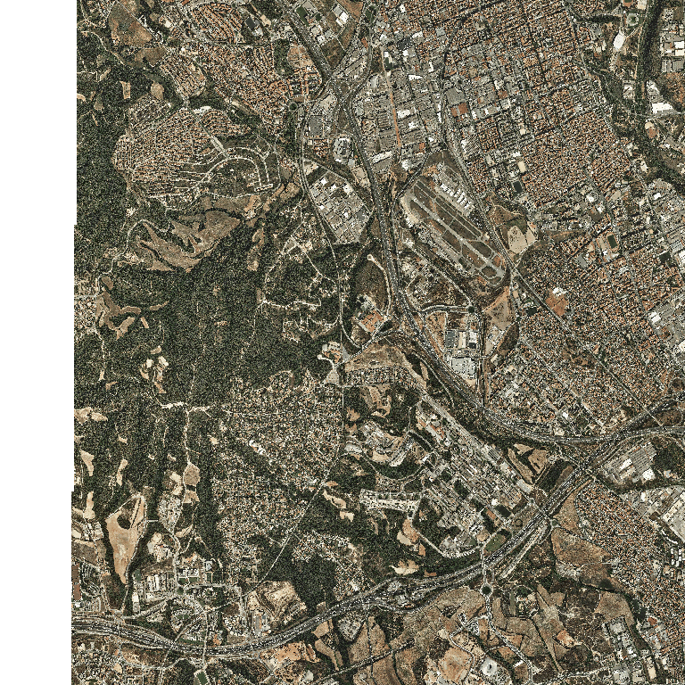
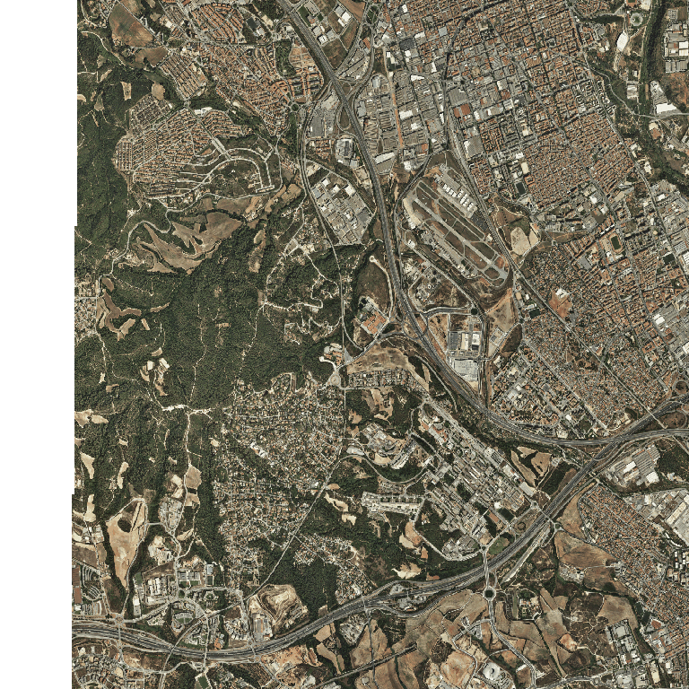
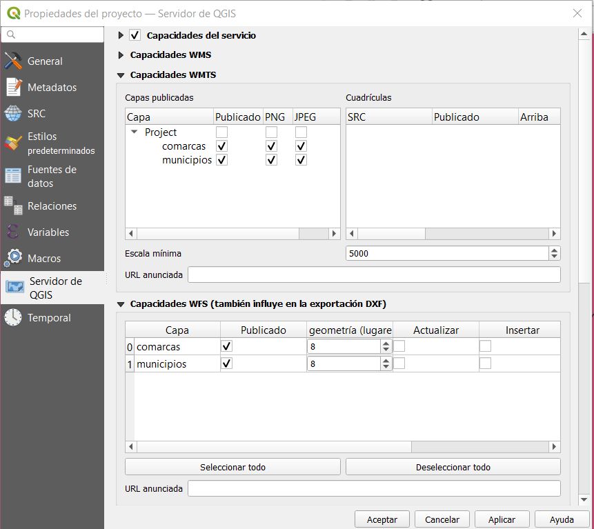
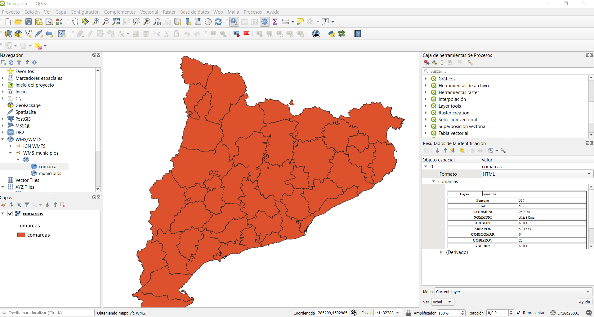

# Servidores de mapas

!!! note "Nota"
    La mayorías de los conceptos son sacados del Libro libre SIG de Victor Olaya http://volaya.github.io/libro-sig/

## Qué es un geoservicio?

Un geoservicio es un servidor que ofrece algún servicio relacionado con el ámbito SIG, su principal función es acceder a información geoespacial existente en diferentes formatos y servir dicha información a clientes a través de protocolos estándares.

El servidor es el elemento encargado de ofrecer el servicio como tal, respondiendo a las peticiones del cliente. A medida que los clientes se hacen más complejos y presentan mayor número de funcionalidades, también los servidores deben ser capaces de proporcionar servicios más elaborados.

Las capacidades fundamentales a las que responden los servidores dentro del ámbito SIG pueden dividirse en los siguientes grupos: [^1]

* **Servir representaciones de los datos.** Los servicios de cartografía Web, tanto en sus orígenes como en la actualidad, son eminentemente gráficos, y en última instancia lo que la aplicación Web correspondiente va a hacer es mostrarnos algún tipo de imagen con un mapa formado a partir de una serie de datos geográficos. Ejemplo WMS

El servidor puede responder directamente a este tipo de necesidades, preparando una imagen a partir de los datos geográficos de los que dispone. En el caso de que estos sean ya imágenes —por ejemplo, imágenes de satélite u ortofotos—, bastará servir estas, transmitiendo una versión escalada de las dimensiones exactas que el cliente necesite para representar en pantalla. En caso de que los datos sean de tipo vectorial, o bien ráster sin una forma de representación implícita —por ejemplo, un Modelo Digital del Terreno— es necesario emplear algún método para asignarles dicha representación. Este puede ser asignado por defecto por el servidor, que establecerá una simbología fija, o bien ofrecer un servicio más complejo en el que el cliente no solo pide una representación gráfica de una serie de datos para una zona dada, sino que además puede especificar cómo crear esa representación (vía SLD).

* **Servir los datos directamente.** Una opción más flexible que lo anterior es que el servidor provea directamente los datos geográficos y sea después el cliente quien los utilice como corresponda, bien sea simplemente representándolos —en cuyo caso debería ser el propio cliente quien establezca la simbología, ya que esta tarea ya no queda en manos del servidor— o bien trabajando con ellos de cualquier otra forma, como por ejemplo analizándolos. Ejemplo WFS, Vector Tiles

Aunque las posibilidades son mayores en este caso, se requieren por parte del cliente unas capacidades mayores, ya que mientras que representar una imagen es algo sumamente sencillo desde el punto de vista técnico, crear esta a partir de los datos geográficos es más complejo.

* **Servir consultas.** Un paso más allá en la funcionalidad que puede ofrecer el servidor es responder a preguntas realizadas por el cliente relativas a los datos, ya sean estas relativas a la parte espacial de dichos datos, o bien a su componente temática. El servidor puede ofrecer como respuesta conjuntos reducidos de los datos de los que dispone, o valores que describan a estos. Estas consultas pueden ser útiles, por ejemplo, para establecer filtros previos cuando se dispone de un conjunto amplio de orígenes de datos. Un cliente Web puede obtener datos de distintos servidores, y puede consultar si, para un zona dada, estos servidores disponen de información, sin más que consultar la extensión cubierta por los datos de cada uno de ellos y comprobar si se interseca con la región de interés. En función de la respuesta, puede o no realizarse posteriormente el acceso a los datos en sí. Ejemplo CSW

* **Servir procesos.** Por último, un servidor puede ofrecer nuevos datos, espaciales o no espaciales, resultantes de algún tipo de proceso o cálculo a partir de datos espaciales. En este caso, el proceso constituye en sí el servicio ofrecido por el servidor, y el cliente debe definir los parámetros de entrada de este y los posibles parámetros de ajuste que resulten necesarios. Los datos con los que se trabaja pueden ser proporcionados por el cliente, incorporándolos a su propia petición, o bien pueden residir en el propio servidor. En este último caso, el servidor ofrece tanto los datos, como la posibilidad de extraer resultados a partir de ellos, es decir, los datos y una herramienta para explotarlos. También pueden emplearse datos en un servidor distinto, a los que el servidor de procesos puede acceder si estos están disponibles, convirtiéndose en cliente de ese segundo servidor. Ejemplo WPS

Las posibilidades que estos servicios brindan son muy numerosas. Por una parte, pueden añadirse funcionalidades avanzadas a interfaces Web, llevando a estas las capacidades propias de los SIG de escritorio. Por otra, la difusión de algoritmos de análisis geográfico resulta más sencilla, pudiendo ofrecerse estos a todo tipo de usuarios sin necesidad de ningún software especializado. Y por último, en ciertos casos pueden rebajarse los tiempos de proceso, ya que, en el caso de operaciones complejas, la mayor potencia del servidor respecto al cliente puede resultar en un mayor rendimiento. El reparto de tareas entre varios servidores (computación distribuida) es otra de las posibilidades que pueden a su vez ampliar la eficiencia de los procesos.

## Qué es un servidor de mapas?

Es un servidor que principalmente provee cartografía a través de la red tanto en modo vectorial como en ráster.
    
## Servidores de mapas estándar

Son servidores de mapas que cumplen los estándares OGC de WMS y/o WFS. 

El listado completo de servidores de mapas que cumplen con los estándares de la OGC se puede ver en: http://www.opengeospatial.org/resource/products/compliant

Algunos software de servidores de mapas son:

### UMN Mapserver 

Es un servidor de código abierto programado en C/C++, permite compartir y editar datos geoespaciales. Originalmente fue desarrollado por la Universidad de Minnesota (UMN) y por eso también se le conoce como Minnesota MapServer para diferenciarlo del producto comercial “map server” de Autodesk. Implementa las especificaciones Web Map Service (WMS) (cliente/servidor), Web Feature Service no-transaccional (WFS) (cliente/servidor), Web Map Context (WMC), Web Coverage Service(WCS), Filter Encoding, Styled Layer Descriptor (SLD), Geography Markup Language (GML), Sensor Observation Service (SOS), Observations and Measurements (OM).

http://www.mapserver.org/

**Principales características**

* Proporciona una API (MapScript) que permite acceder a las funcionalidades de MapServer desde diferentes lenguajes de programación como PHP, Java, Python, Perl, Ruby y .NET (C#).
* Soporta múltiples formatos de entrada (vectorial/ráster) y salida ya que usa GDAL/OGR.
* Soporta fuentes TrueType (útil para el etiquetado de elementos).
* Configuración “al vuelo” vía parámetros GET pasados por URL.
* Configuración basada en el fichero mapfile .map.
* Incluye la posibilidad de usar una plantilla HTML MapServer para generar una página web.
* Es multiplataforma
* Incluye un componente de cacheado MapCache para generar pirámides de teselas (tiles) con la finalidad de acelerar y optimizar la respuesta a la hora de servir mapas. Soporta el estándar WMTS, también soporta otras salidas como TMS, VirtualEarth/Bing y peticiones Google Maps.
* Incluye un componente TinyOWS que da soporte para edición de datos a través del protocolo WFS transactional (WFS-T).
* Mapbox Vector Tile (MVT)

### GeoServer

Es un servidor de código abierto programado en Java, permite compartir y editar datos geoespaciales. GeoServer sirve de implementación de referencia del estándar Web Feature Service (WFS) de la OGC, también implementa las especificaciones Web Map Service (WMS) y Web Coverage Service(WCS).

http://geoserver.org/

**Principales características**

* Fácil utilización y administración a través de una herramienta de administración web. No es necesario tocar archivos de configuración.
* Soporte para edición de datos a través del protocolo WFS transactional (WFS-T).
* Al ser programado en Java está basado en servlets (JEE), puede funcionar en cualquier contenedor de servlets. Es multiplataforma.
* Es compatible para ser usado con extensiones.
* Incluye integrado un cliente OpenLayers que permite visualizar las capas de datos.
* Incluye un componente de cacheado GeoWebCache para generar pirámides de teselas (tiles) con la finalidad de acelerar y optimizar la respuesta a la hora de servir mapas. Soporta los estándares WMS-C y WMTS, también soporta otras salidas como TMS, Google Maps KML, Virtual Earth.
* Hay formatos y opciones de publicación adicionales disponibles como extensiones, incluido el Servicio de procesamiento web (WPS) y el Servicio de mosaicos de mapas web (WMTS).
* Produce mosaicos vectoriales en tres formatos: GeoJSON, TopoJSON y MapBox Vector (MVT)

### Maproxy 

Es un proxy de código abierto para datos geoespaciales. Almacena en caché, acelera y transforma los datos de los servicios de mapas existentes y sirve a cualquier cliente GIS de escritorio o web.

https://mapproxy.org

MapProxy no es sólo una solución de caché de mosaico, también ofrece muchas características nuevas e innovadoras como soporte completo para clientes WMS.

**Principales características**

* Sirve como cache de teselas
* Reprojecta WMS y teselas a otros SRS
* Guardar teselas identicas sólo una vez (Ej. teselas del mar)
* Permite manipular las bandas de las imagenes para crear imagenes de otros colores (Ej. escala de grises)
* Permite pregenerar caches (Seeding) de areas determinadas
* Combina múltiples capas y servicios

### QGIS Server 

Es una implementación de código abierto WMS 1.3, WFS 1.0.0, WFS 1.1.0 y WCS 1.1.1 que, además, implementa características cartográficas avanzadas para mapeo temático. QGIS Server es una aplicación FastCGI / CGI (Common Gateway Interface) escrita en C ++ que funciona junto con un servidor web (por ejemplo, Apache, Nginx). Tiene compatibilidad con el complemento Python, lo que permite un desarrollo e implementación rápidos y eficientes de nuevas funciones.

https://docs.qgis.org/testing/en/docs/user_manual/working_with_ogc/server/index.html

**Principales características**

* QGIS Server utiliza QGIS como back-end para la lógica GIS y para la representación de mapas. Además, la biblioteca Qt se utiliza para gráficos y para programación C ++ independiente de la plataforma. A diferencia de otro software WMS, el QGIS Server utiliza reglas cartográficas como lenguaje de configuración, tanto para la configuración del servidor como para las reglas cartográficas definidas por el usuario.
* Como QGIS Desktop y QGIS Server utilizan las mismas bibliotecas de visualización, los mapas que se publican en la web tienen el mismo aspecto que en el GIS de escritorio.

### Cómo preparar la geoinformación

Antes de publicar la información es importante preparar la misma, ya que esto permitirá crear servicios de mejor calidad, ya sea mejorando su rendimiento y/o creando creando un servicio útil y atractivo para los usuarios.

Los principales servidores de mapas pueden consumir la información de diferentes fuentes como por ejemplo:

* *Bases de datos*: cargar la información en una base de datos geográfica es muy recomendable ya sea tanto para trabajar con la misma como para su publicación. Ya que permite hacer operaciónes sobre la información y permite de una forma sencilla seleccionar que datos o atributos queremos publicar sin tener que duplicar la información
* *RAW data*: en algunos casos queremos publicar los datos en el formato de origen y sin procesar. Por ejemplo imágenes de satelite. Se puede publicar el archivo original o se puede publicar una imágen creada a partir de una combinación de bandas.
* *Pirámides cache*: Generar pirámides de cache permite mejorar el rendimiento de nuestro servicio ya que para cada petición no tiene que procesar la información y generar la respuesta sino que ya tiene la respuesta generada en cache y sirve directamente esta respuesta.
* *Generalizar la información*: preparar la información para su visualización dependiendo de la escala. Por ejemplo generar los overview de imágenes (esto sirve para generar imágenes de menor resolución)

Ejemplo

Imagen sin overview

Imagen con overview

## Práctica implementar un servidor de mapas

1. Abrir un nuevo proyecto en QGIS

2. Cargar la capa de municipios que nos descargarmos del ICGC.

3. Generar la capa de comarcas a partir de la capa de municipios.

4. Dar estilo a ambas capas.

5. Guardar el proyecto con el nombre mun_com.qgs

6. Modificar las propiedes del proyecto. En la pestaña de Servidor de QGIS

    * Seleccionar la casilla de Capacidades del servicio
    * Capacidades WMTS -> Seleccionar las casilla de publicado, png y jpeg para las capas
    * Capacidades WFS -> Seleccionar las casilla de publicado para las capas

    
    Propiedades del proyecto

7. Arrancar el Apache desde el panel de control del XAMPP

8. Comprobar que el QGIS Server está funcionando: abrir en el navegador http://localhost/cgi-bin/qgis_mapserv.fcgi.exe?SERVICE=WMS&VERSION=1.3.0&REQUEST=GetCapabilities

8. Mirar el capabilities de nuestro servidor: abrir en el navegador http://localhost/cgi-bin/qgis_mapserv.fcgi.exe?SERVICE=WMS&VERSION=1.3.0&REQUEST=GetCapabilities&map=[RUTA_DE_ARCHIVO]/mun_com.qgs

9. Crear un nuevo proyecto en blanco en el QGIS y cargar nuestro servicio WMS.

Qgis con nuestro WMS

!!! question "Ejercicio"
    Crear un visor con Leaflet.js con la capa de comarcas de nuestro WMS.

## Referencias

[^1]: http://volaya.github.io/libro-sig/
