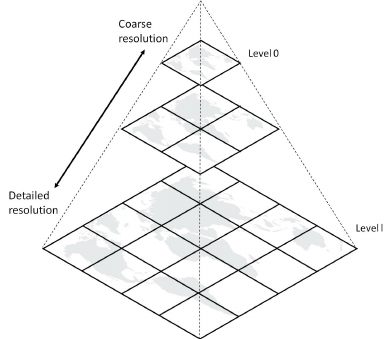
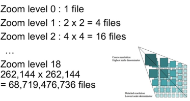
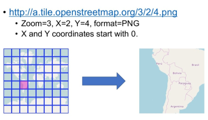
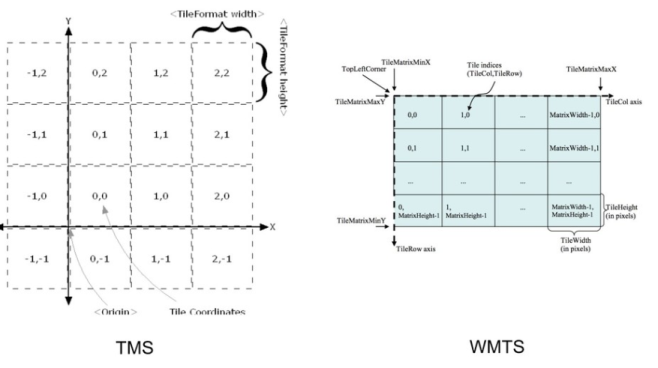
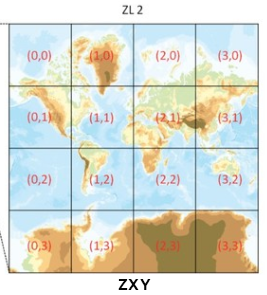

# WMTS

Un WMTS es un servicio que permite almacenar los datos recientemente leídos, por tanto agilizar la carga de los mismos en caso de que estos vuelvan a ser solicitados (caché). Este servicio usa un modelo de teselas (Tiling Model) parametrizado de tal manera que un cliente puede hacer peticiones de un conjunto discreto de valores y recibir rápidamente del servidor fragmentos de imágenes prerenderizadas (Tiles), que generalmente ya no requieren de ninguna manipulación posterior para ser mostrados en pantalla.

Cada una de las capas (layers) de un servidor WMTS sigue una o diversas estructuras piramidales de escalas (Tile Matrix sets o conjunto de Matrices de Teselas), en la que cada escala o nivel de la pirámide (Tile Matrix o Matriz de Teselas), es una rásterización y fragmentación regular de los datos geográficos a una escala o tamaño de píxel concreto. Por ello, una capa puede estar disponible en varios sistemas de coordenadas, y tener diferente ámbito en función de éstos.

El WMTS de OGC proporciona un enfoque complementario al WMS; a diferencia del WMS que fue concebido para poder compartir por renderizado mapas personalizados y se adoptó como una solución ideal para mostrar datos dinámicos, el WMTS renuncia a la personalización de estos mapas para obtener una mayor escalabilidad, sirviendo datos prerenderizados donde la envolvente y las escalas han sido restringidas a un conjunto discreto de teselas que siguen una geometría de malla regular.

Se puede ver la especificación en [https://www.ogc.org/standards/wmts](https://www.ogc.org/standards/wmts)

Una especificación anterior para esto es el Tile Map Service (TMS). Es más simple que WMTS. Fue desarrollado por miembros de OSGeo y no está respaldada por un organismo oficial de estándares.

También existe la especificación ZXY o "slippy map" que es igual que TMS pero la Y empieza por arriba a la izquierda. Esta especificación tampoco está respaldada por un organismo oficial de estándares, pero es la más usada ya que es la que usa Google Maps, OpenStreetMap entre otros. 

Para cargar la imágenes se ulitza una llamada HTTP rest dónde se especifica;
 
> https://.../.../z/x/y.format

> Z= Nivel de zoom

> X=coordenada X

> Y=coordenada Y

> Formato 

>   Raster: Imágen png o JPEG

http://a.tile.openstreetmap.org/3/2/4.png

## Protocolos

* TMS (Tile Map Service): X Y coordenadas empiezan de debajo  a la izquierda (típico eje cartesiano de coordenadas)

* WMTS (Web Map Tile Service): OGC estandard , corrdenadas empiezan de arriba  a la izquierda.

* ZXY o "slippy map": Igual que TMS pero la Y empieza por arriba a la izquierda

Aquí se puede ver una comparación entre los valores de los indices de las teselas de Google (ZXY) y TMS. https://www.maptiler.com/google-maps-coordinates-tile-bounds-projection
